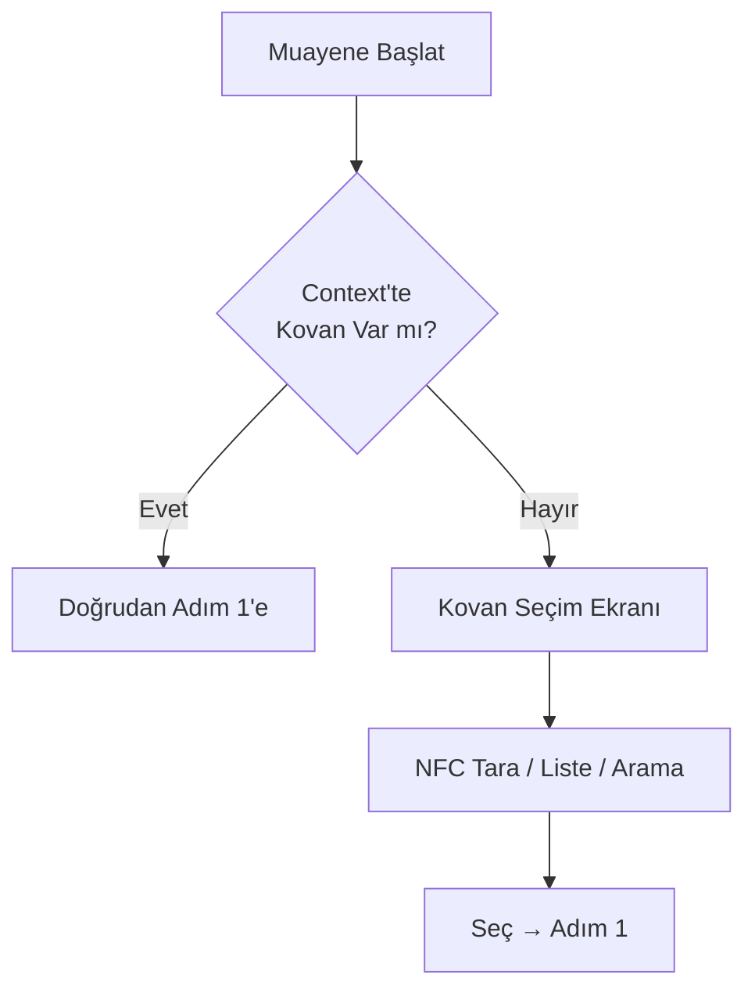

# BeeMaster AI — Hive Inspections (Kovan Muayeneleri) Modülü v1.0

> **Amaç:** Arıcının petek başındaki çekirdek iş akışı. Ses/Form/Foto ile 60 saniyede muayene kaydı, AI anomali tespiti, eylem önerileri, geçmiş karşılaştırma.

---

## 1. Modül Özeti

| Özellik | Detay |
|---------|-------|
| **Rota** | `/inspections/new` (Sihirbaz), `/inspections/:id` (Detay), `/inspections` (Liste) |
| **Erişim** | Tüm kullanıcılar |
| **Veri Kaynağı** | IndexedDB (inspections, hives), Supabase Sync, Local AI (Hermes), Remote AI (MCP) |
| **Offline** | %100 — Ses/Metin/Foto lokal, AI lokal model, Senkron kuyruğu |
| **Performans** | Sihirbaz açılış < 500ms, AI analiz < 3s (lokal), < 8s (remote) |

---

## 2. Kullanıcı Hikayeleri

| ID | Hikaye | Öncelik |
|----|--------|---------|
| IN-01 | Petek başında eldivenle, parmakla 60 sn'de muayene kaydetmek (Ses ana, Form detay, Foto kanıt) | P0 |
| IN-02 | NFC/QR ile kovan otomatik seçip muayene başlatmak | P0 |
| IN-03 | AI son muayenelerle karşılaştırıp anomali bulsun (Varroa artışı, Ana arı kaybı, Güç düşüşü) | P0 |
| IN-04 | AI önerileri "Neden?" açıklamasıyla gelsin (Literatür referansı + Kovan + Kovan geçmişi) | P0 |
| IN-05 | Muayene geçmişini zaman çizelgesinde görmek, iki muayeneyi yan yana karşılaştırmak | P1 |
| IN-06 | Şablon muayene (Hızlı: Varroa sayımı, Kış hazırlığı, Bahar kontrolü) | P1 |
| IN-07 | Ses kaydını metne çevir (STT - Whisper.cpp lokal) ve düzenleyebilmek | P1 |
| IN-08 | Muayene taslağını kaydedip daha sonra tamamlamak | P1 |

---

## 3. Muayene Sihirbazı Akışı (Inspection Wizard)

### 3.1 Adım 0: Kovan Seçimi (Context-Aware)



**Kovan Seçim Ekranı:**
- Son kullanılan 5 kovan (chips)
- Arı üssü filtresi + Arama
- NFC "Etiketi Tara" butonu (Web NFC / Native)
- "Yeni Kovan Ekle" shortcut

### 3.2 Adım 1: Yöntem Seçimi (En az 1 zorunlu)

```
┌─────────────────────────────────────┐
│  NASIL MÜAYENE YAPMAK İSTERSİNİZ?   │
│  (En az birini seçin, hepsini yapabilirsiniz) │
├─────────────┬─────────────┬─────────┤
│   🎙 SES    │  📝 FORM    │  📷 FOTO │
│  (Ana)      │  (Detay)    │ (Kanıt)  │
│             │             │          │
│  [● Seçili] │  [○ Seçili] │ [○ Seçili]│
└─────────────┴─────────────┴─────────┘
              [DEVAM →]
```

### 3.3 Adım 2A: Sesli Kayıt (Voice Recording)

```tsx
// components/inspection/VoiceRecordingStep.tsx
export function VoiceRecordingStep({ onNext, onSkip, transcript, setTranscript }) {
  const [recording, setRecording] = useState(false);
  const [duration, setDuration] = useState(0);
  const [audioLevel, setAudioLevel] = useState(0);
  const [processing, setProcessing] = useState(false);

  // Web Audio API + MediaRecorder + Whisper.cpp (WASM)
  
  return (
    <div className="flex flex-col items-center space-y-6 p-4">
      {/* Mikrofon Butonu - Basılı Tut */}
      <button
        className={cn(
          'relative w-24 h-24 rounded-full flex items-center justify-center transition-all',
          recording 
            ? 'bg-error ring-4 ring-error/30 animate-pulse' 
            : 'bg-honey-400/20 border-2 border-honey-400/30 text-honey-400'
        )}
        onMouseDown={startRecording}
        onMouseUp={stopRecording}
        onTouchStart={startRecording}
        onTouchEnd={stopRecording}
        disabled={processing}
        aria-label={recording ? 'Kaydetmeyi bitir' : 'Sesli not başlat'}
      >
        {recording ? (
          <MicOff className="w-10 h-10 text-error" />
        ) : (
          <Mic className="w-10 h-10" />
        )}
        {/* Dalga formu animasyonu */}
        {recording && (
          <AudioWaveform level={audioLevel} className="absolute inset-0" />
        )}
      </button>

      {recording && (
        <div className="text-center">
          <p className="text-2xl font-mono font-bold text-honey-400">{formatDuration(duration)}</p>
          <p className="text-sm text-neutral-400 mt-1">Konuşun... (Max 5 dk)</p>
        </div>
      )}

      {/* Transcript Önizleme */}
      {transcript && !recording && (
        <div className="w-full max-w-md">
          <label className="block text-sm font-medium text-neutral-400 mb-2">Metin Önizleme (Düzenleyebilirsiniz)</label>
          <Textarea
            value={transcript}
            onChange={e => setTranscript(e.target.value)}
            rows={4}
            placeholder="Ses metni buraya yazılacak..."
            className="bg-neutral-800 border-neutral-600"
          />
        </div>
      )}

      {/* Aksiyonlar */}
      <div className="flex gap-3 w-full max-w-md">
        {transcript && (
          <Button variant="primary" fullWidth onClick={onNext} rightIcon={<ArrowRight className="w-4 h-4" />}>
            Sonraki
          </Button>
        )}
        <Button variant="ghost" fullWidth onClick={onSkip}>
          {transcript ? 'Atla' : 'Şimdi Değil'}
        </Button>
      </div>
    </div>
  );
}
```

### 3.4 Adım 2B: Yapılandırılmış Form (Structured Form)

```tsx
// components/inspection/InspectionFormStep.tsx
export function InspectionFormStep({ data, onChange, onNext }) {
  return (
    <div className="space-y-4 p-4 max-w-xl mx-auto">
      {/* Hava - Otomatik */}
      <FormField label="Hava Durumu" hint="Konumdan otomatik alındı">
        <WeatherDisplay weather={data.weather} editable={false} />
      </FormField>

      {/* Kovan Gücü - 5'li Dot Rating */}
      <FormField label="Kovan Gücü *">
        <StrengthRating 
          value={data.strength} 
          onChange={v => onChange({ strength: v })}
        />
      </FormField>

      {/* Huysuzluk */}
      <FormField label="Huysuzluk *">
        <SegmentedControl
          value={data.temperament}
          onChange={v => onChange({ temperament: v })}
          options={[
            { value: 'calm', label: 'Sakin', icon: <Smile className="w-4 h-4" /> },
            { value: 'moderate', label: 'Orta', icon: <Meh className="w-4 h-4" /> },
            { value: 'defensive', label: 'Savunmalı', icon: <Frown className="w-4 h-4" /> },
            { value: 'aggressive', label: 'Saldırgan', icon: <Zap className="w-4 h-4" /> },
          ]}
        />
      </FormField>

      {/* Ana Arı Durumu */}
      <FormField label="Ana Arı *">
        <Select value={data.queen_status} onChange={v => onChange({ queen_status: v })}>
          <SelectItem value="seen">Gördüm</SelectItem>
          <SelectItem value="not_seen">Görmedim</SelectItem>
          <SelectItem value="cells_present">Kraliçe Hucreleri Var</SelectItem>
          <SelectItem value="virgin">Yeni (Bakır) Ana Arı</SelectItem>
          <SelectItem value="missing">Yok / Kayıp</SelectItem>
        </Select>
      </FormField>

      {/* PETEK DAĞILIMI — FrameCounter Chips (KRİTİK) */}
      <FormField label="Petek Dağılımı (%)">
        <FrameCounterChips
          value={data.frame_distribution}
          onChange={v => onChange({ frame_distribution: v })}
          totalFrames={data.hive?.frameCount || 10}
        />
      </FormField>

      {/* Varroa Sayımı */}
      <FormField label="Varroa Sayımı">
        <div className="space-y-3">
          <div className="flex gap-2">
            <Input
              type="number"
              min={0}
              max={200}
              placeholder="Sayı"
              value={data.varroa_count}
              onChange={v => onChange({ varroa_count: parseInt(v) || 0 })}
              className="w-24"
            />
            <Select value={data.varroa_method} onChange={v => onChange({ varroa_method: v })}>
              <SelectItem value="alcohol_wash">Alkol Yıkama (100 arı)</SelectItem>
              <SelectItem value="sugar_shake">Pudra Şekeri (100 arı)</SelectItem>
              <SelectItem value="sticky_board">Çöp Tablası (24 sa)</SelectItem>
              <SelectItem value="visual">Görsel Tahmin</SelectItem>
            </Select>
          </div>
          {data.varroa_count !== undefined && (
            <VarroaBadgeInline count={data.varroa_count} method={data.varroa_method} />
          )}
        </div>
      </FormField>

      {/* Hastalık İşaretleri */}
      <FormField label="Hastalık İşaretleri">
        <DiseaseCheckboxGroup
          value={data.disease_signs}
          onChange={v => onChange({ disease_signs: v })}
        />
      </FormField>

      {/* Genel Not */}
      <FormField label="Genel Not">
        <Textarea
          value={data.notes}
          onChange={v => onChange({ notes: v })}
          rows={3}
          placeholder="Özel durum, gözlem, plan..."
        />
      </FormField>

      <Button variant="primary" fullWidth onClick={onNext} rightIcon={<ArrowRight className="w-4 h-4" />}>
        Sonraki
      </Button>
    </div>
  );
}
```

#### FrameCounterChips (Petek Dağılımı Girişi)

```tsx
// components/inspection/FrameCounterChips.tsx
export function FrameCounterChips({ value, onChange, totalFrames }) {
  const types = [
    { key: 'brood', label: 'Yumurtalık', icon: Egg, color: 'amber' },
    { key: 'honey', label: 'Bal', icon: Droplets, color: 'honey' },
    { key: 'pollen', label: 'Polen', icon: CircleDot, color: 'orange' },
    { key: 'foundation', label: 'Perga', icon: Layout, color: 'neutral' },
    { key: 'empty', label: 'Boş', icon: Square, color: 'slate' },
  ];

  const currentTotal = Object.values(value).reduce((a, b) => a + b, 0);
  const remaining = totalFrames - currentTotal;

  return (
    <div className="space-y-3">
      {/* Hızlı Dağılım Butonları */}
      <div className="flex flex-wrap gap-2">
        {types.map(t => (
          <FrameTypeChip
            key={t.key}
            type={t}
            count={value[t.key] || 0}
            onIncrement={() => onChange({ ...value, [t.key]: (value[t.key] || 0) + 1 })}
            onDecrement={() => onChange({ ...value, [t.key]: Math.max(0, (value[t.key] || 0) - 1) })}
            disabled={remaining <= 0 && (value[t.key] || 0) === 0}
          />
        ))}
      </div>

      {/* Toplam / Kalan */}
      <div className="flex items-center justify-between text-sm text-neutral-400 p-2 bg-neutral-800/50 rounded-lg">
        <span>Atanan: <span className="text-neutral-50 font-mono">{currentTotal}</span> / {totalFrames}</span>
        <span className={cn('font-mono', remaining < 0 ? 'text-error' : remaining === 0 ? 'text-success' : 'text-warning')}>
          Kalan: {remaining}
        </span>
      </div>

      {/* Yüzde Özeti */}
      <div className="grid grid-cols-5 gap-1 text-[11px]">
        {types.map(t => (
          <div key={t.key} className="text-center">
            <div className="font-medium" style={{ color: `var(--color-${t.color}-400)` }}>
              {totalFrames > 0 ? Math.round(((value[t.key] || 0) / totalFrames) * 100) : 0}%
            </div>
            <div className="text-neutral-500">{t.label}</div>
          </div>
        ))}
      </div>
    </div>
  );
}

function FrameTypeChip({ type, count, onIncrement, onDecrement, disabled }) {
  const colors = {
    amber: 'bg-amber-500/20 border-amber-500/30 text-amber-400',
    honey: 'bg-honey-400/20 border-honey-400/30 text-honey-400',
    orange: 'bg-orange-500/20 border-orange-500/30 text-orange-400',
    neutral: 'bg-neutral-500/20 border-neutral-500/30 text-neutral-400',
    slate: 'bg-slate-500/20 border-slate-500/30 text-slate-400',
  };

  return (
    <div className={cn('flex items-center gap-1 px-3 py-2 rounded-xl border text-sm font-medium', colors[type.color], disabled && 'opacity-50')}>
      <button onClick={onDecrement} disabled={count === 0 || disabled} className="p-1 -ml-1" aria-label="Azalt">
        <Minus className="w-4 h-4" />
      </button>
      <span className="flex items-center gap-1">
        <type.icon className="w-3.5 h-3.5" />
        <span>{type.label}</span>
      </span>
      <span className="w-6 text-center font-mono">{count}</span>
      <button onClick={onIncrement} disabled={disabled} className="p-1 -mr-1" aria-label="Artır">
        <Plus className="w-4 h-4" />
      </button>
    </div>
  );
}
```

### 3.5 Adım 2C: Fotoğraflar (Opsiyonel)

```tsx
// components/inspection/PhotoStep.tsx
export function PhotoStep({ photos, onAdd, onRemove, onNext, onSkip }) {
  return (
    <div className="space-y-4 p-4 max-w-xl mx-auto">
      <div className="flex items-center justify-between">
        <h3 className="font-semibold">Fotoğraflar (İsteğe Bağlı)</h3>
        <span className="text-xs text-neutral-400">Max 5 • {photos.length}/5</span>
      </div>

      {/* Grid */}
      <div className="grid grid-cols-3 gap-2">
        {photos.map((photo, i) => (
          <div key={i} className="relative aspect-square rounded-xl overflow-hidden bg-neutral-800">
            
            <div className="absolute inset-0 bg-black/50 flex items-center justify-center opacity-0 hover:opacity-100 transition-opacity">
              <button onClick={() => onRemove(i)} className="p-2 bg-error rounded-lg">
                <Trash2 className="w-5 h-5" />
              </button>
            </div>
            {/* Etiket Badge */}
            <span className="absolute bottom-1 left-1 px-1.5 py-0.5 bg-black/70 text-[10px] rounded">{photo.tag}</span>
          </div>
        ))}
        {photos.length < 5 && (
          <button onClick={onAdd} className="relative aspect-square rounded-xl border-2 border-dashed border-neutral-700 flex flex-col items-center justify-center gap-1 text-neutral-500 hover:border-honey-400 hover:text-honey-400 transition-colors">
            <Camera className="w-8 h-8" />
            <span className="text-xs">Ekle</span>
          </button>
        )}
      </div>

      {/* Aksiyonlar */}
      <div className="flex gap-3">
        <Button variant="primary" fullWidth onClick={onNext} rightIcon={<ArrowRight className="w-4 h-4" />}>
          Analiz Et
        </Button>
        <Button variant="ghost" fullWidth onClick={onSkip}>Atla</Button>
      </div>
    </div>
  );
}
```

### 3.6 Adım 3: AI Analizi (Loading + Sonuç)

```tsx
// components/inspection/AIAnalysisStep.tsx
export function AIAnalysisStep({ inspectionData, onComplete, onBack }) {
  const [stage, setStage] = useState<'analyzing' | 'result' | 'error'>('analyzing');
  const [result, setResult] = useState<AIAnalysisResult | null>(null);

  useEffect(() => {
    runAnalysis();
  }, [inspectionData]);

  const runAnalysis = async () => {
    setStage('analyzing');
    try {
      // Local AI first (Hermes)
      const localResult = await analyzeInspectionLocal(inspectionData);
      
      // If online & complex, enhance with remote (MCP)
      if (navigator.onLine && needsRemoteAnalysis(localResult)) {
        const remoteResult = await analyzeInspectionRemote(inspectionData, localResult);
        setResult(mergeResults(localResult, remoteResult));
      } else {
        setResult({ ...localResult, source: 'local' });
      }
      setStage('result');
    } catch (err) {
      setStage('error');
    }
  };

  if (stage === 'analyzing') {
    return (
      <AIAnalyzingScreen 
        steps={[
          { id: 'structure', label: 'Veri yapılandırılıyor', done: true },
          { id: 'anomaly', label: 'Anomali taranıyor', active: true },
          { id: 'risk', label: 'Risk skorlanıyor', done: false },
          { id: 'recommend', label: 'Öneriler hazırlanıyor', done: false },
        ]}
      />
    );
  }

  if (stage === 'error') {
    return (
      <div className="text-center py-12">
        <AlertTriangle className="w-16 h-16 mx-auto text-warning mb-4" />
        <h3 className="text-lg font-medium mb-2">Analiz Başarısız</h3>
        <p className="text-neutral-400 mb-6">Yerel analiz yapıldı ama detaylı sonuçlar için internet gerekli.</p>
        <div className="flex gap-3 justify-center">
          <Button variant="primary" onClick={runAnalysis}>Tekrar Dene</Button>
          <Button variant="outline" onClick={() => onComplete({ ...inspectionData, ai_skipped: true })}>Kaydet (Analizsiz)</Button>
        </div>
      </div>
    );
  }

  // Sonuç Ekranı
  return (
    <div className="space-y-6 p-4 max-w-xl mx-auto">
      {/* Özet */}
      <Card variant="glass" padding="md">
        <div className="flex items-start gap-3">
          <Info className="w-6 h-6 text-honey-400 flex-shrink-0 mt-0.5" />
          <div>
            <p className="font-medium text-neutral-50">AI Özeti</p>
            <p className="text-sm text-neutral-400 mt-1">{result.summary}</p>
            <p className="text-xs text-neutral-500 mt-2">Kaynak: {result.source === 'local' ? '📱 Yerel Model' : '☁️ Hibrit (Yerel + Bulut)'}</p>
          </div>
        </div>
      </Card>

      {/* Anomaliler */}
      {result.anomalies.length > 0 && (
        <section>
          <h4 className="font-medium text-neutral-50 mb-3 flex items-center gap-2">
            <AlertTriangle className="w-5 h-5 text-warning" />
            Tespit Edilen Anomaliler ({result.anomalies.length})
          </h4>
          <div className="space-y-2">
            {result.anomalies.map((a, i) => (
              <AnomalyCard key={i} anomaly={a} index={i} />
            ))}
          </div>
        </section>
      )}

      {/* Öneriler */}
      {result.recommendations.length > 0 && (
        <section>
          <h4 className="font-medium text-neutral-50 mb-3 flex items-center gap-2">
            <Lightbulb className="w-5 h-5 text-honey-400" />
            AI Önerileri
          </h4>
          <div className="space-y-2">
            {result.recommendations.map((r, i) => (
              <RecommendationCard key={i} rec={r} index={i} />
            ))}
          </div>
        </section>
      )}

      {/* Risk Skorları */}
      <Card variant="bordered" padding="md">
        <h4 className="font-medium text-neutral-50 mb-3">Risk Skorları</h4>
        <div className="grid grid-cols-2 sm:grid-cols-4 gap-3">
          {Object.entries(result.risk_scores).map(([key, score]) => (
            <RiskScoreBadge key={key} label={key} score={score} />
          ))}
        </div>
      </Card>

      {/* Aksiyonlar */}
      <div className="flex gap-3">
        <Button variant="outline" fullWidth onClick={onBack} leftIcon={<ArrowLeft className="w-4 h-4" />}>
          Düzenle
        </Button>
        <Button variant="primary" fullWidth onClick={() => onComplete({ ...inspectionData, ...result })} rightIcon={<Check className="w-4 h-4" />}>
          Kaydet ve Tamamla
        </Button>
      </div>
    </div>
  );
}
```

#### AnomalyCard & RecommendationCard

```tsx
function AnomalyCard({ anomaly, index }) {
  const severityColors = {
    info: 'border-info bg-info-bg text-info',
    warning: 'border-warning bg-warning-bg text-warning',
    critical: 'border-error bg-error-bg text-error',
  };

  return (
    <Card variant="bordered" padding="md" className={severityColors[anomaly.severity]}>
      <div className="flex items-start gap-3">
        <div className="flex-shrink-0 w-8 h-8 rounded-full flex items-center justify-center bg-white/10">
          {anomaly.severity === 'critical' && <AlertCircle className="w-4 h-4" />}
          {anomaly.severity === 'warning' && <AlertTriangle className="w-4 h-4" />}
          {anomaly.severity === 'info' && <Info className="w-4 h-4" />}
        </div>
        <div className="flex-1">
          <div className="flex items-center gap-2">
            <span className="font-medium">{anomaly.type.replace('_', ' ').toUpperCase()}</span>
            <Badge variant={anomaly.severity}>{anomaly.severity}</Badge>
            <span className="text-xs text-white/60">%{Math.round(anomaly.confidence * 100)} güven</span>
          </div>
          <p className="text-sm mt-1 opacity-90">{anomaly.evidence}</p>
          {anomaly.threshold !== undefined && (
            <p className="text-xs mt-1 font-mono opacity-70">
              Eşik: {anomaly.threshold} • Mevcut: {anomaly.current}
            </p>
          )}
        </div>
      </div>
    </Card>
  );
}

function RecommendationCard({ rec, index }) {
  const priorityColors = {
    critical: 'border-error bg-error-bg text-error',
    high: 'border-warning bg-warning-bg text-warning',
    medium: 'border-info bg-info-bg text-info',
    low: 'border-neutral-600 bg-neutral-800/50 text-neutral-400',
  };

  return (
    <Card variant="bordered" padding="md" className={priorityColors[rec.priority]}>
      <div className="flex items-start gap-3">
        <div className="flex-shrink-0 w-8 h-8 rounded-full flex items-center justify-center bg-white/10">
          {rec.priority === 'critical' && <AlertCircle className="w-4 h-4" />}
          {rec.priority === 'high' && <AlertTriangle className="w-4 h-4" />}
          {rec.priority === 'medium' && <Lightbulb className="w-4 h-4" />}
          {rec.priority === 'low' && <Info className="w-4 h-4" />}
        </div>
        <div className="flex-1">
          <div className="flex items-center gap-2">
            <span className="font-medium">{index + 1}. {rec.action}</span>
            <Badge variant={rec.priority}>{rec.priority}</Badge>
          </div>
          <p className="text-sm mt-1 opacity-90">{rec.reasoning}</p>
          <div className="flex items-center gap-3 mt-2 text-xs opacity-70">
            <span className="flex items-center gap-1">
              <Calendar className="w-3 h-3" />
              Son tarih: {format(new Date(rec.due_date), 'dd MMM', { locale: tr })}
            </span>
            {rec.references && rec.references.length > 0 && (
              <span className="flex items-center gap-1">
                <BookOpen className="w-3 h-3" />
                {rec.references.slice(0, 2).join(', ')}
              </span>
            )}
          </div>
        </div>
      </div>
    </Card>
  );
}
```

---

## 4. Muayene Detay Sayfası (/inspections/:id)

```
InspectionDetailPage
├── StickyHeader
│   ├── Back, Tarih, Kovan Adı, 3-dot Menu
│   └── Status: [Kaydedildi] [Senkronize] [Taslak]
│
├── SummaryBar
│   ├── Güç Badge, Ana Arı Badge, Varroa Badge (Trend ok ile)
│   ├── Hava: 24°C %45 • Süre: 12 dk
│   └── AI Badge: [Yerel] / [Hibrit] / [Atlandı]
│
├── Tabs: [Genel] [Anomaliler] [Öneriler] [Fotoğraflar] [Ses] [Geçmişe Karşılaştır]
│
├── GENEL SEKME
│   ├── Form verileri (Read-only, düzenle butonu ile)
│   ├── Petek Dağılımı (FrameCounterChips - görsel)
│   └── Notlar
│
├── ANOMALİLER SEKMESİ
│   └── AnomalyCard listesi (Severity sıralı) + "Çözüldü" işaretleme
│
├── ÖNERİLER SEKMESİ
│   ├── RecommendationCard listesi
│   ├── Her öneri için: [Yapıldı] [Planla] [Reddet] aksiyonları
│   └── "Tümünü Planla" → Takvim/Todo entegrasyonu
│
├── FOTOĞRAFLAR SEKMESİ
│   ├── Grid (büyütme modalı ile)
│   ├── Etiketler: Petek / Ana Arı / Hastalık / Genel
│   └── [Yeni Foto Ekle] (Offline blob)
│
├── SES SEKMESİ
│   ├── Oynatıcı (Waveform + Hız kontrolü)
│   ├── Transkript (Düzenlenebilir)
│   └── [Paylaş] [İndir]
│
└── KARŞILAŞTIR SEKMESİ
    ├── Kovanın son 5 muayenesi (Mini kartlar)
    ├── Trend Grafikleri: Güç, Varroa, Yumurtalık Alanı, Bal Alanı
    └── "İki Muayene Seç → Yan Yana Karşılaştır" Modal
```

---

## 5. AI Analiz Motoru (Local + Remote)

### 5.1 Yerel Model (Hermes + Custom Head)

```python
# models/inspection_analyzer.py (PyTorch → ONNX → WASM)
class InspectionAnalyzer:
    def __init__(self):
        self.model = ort.InferenceSession('models/inspection_analyzer.onnx')
        self.tokenizer = AutoTokenizer.from_pretrained('tokenizer/')
        self.thresholds = load_thresholds()  # Bölge/İrk özel
    
    def analyze(self, inspection: InspectionData) -> AIAnalysisResult:
        # 1. Rule-based hızlı kontrol (ms)
        rule_anomalies = self.rule_engine.check(inspection)
        
        # 2. Embedding + Classification (local model)
        features = self.extract_features(inspection)
        anomaly_probs = self.model.run(None, {'input': features})
        
        # 3. Trend analizi (son 3-5 muayene)
        trends = self.analyze_trends(inspection.hive_id)
        
        # 4. Birleştir + Önceliklendir
        anomalies = self.merge_and_rank(rule_anomalies, anomaly_probs, trends)
        
        # 5. Öneri üret (Template + Context)
        recommendations = self.generate_recommendations(anomalies, inspection)
        
        # 6. Risk skorları
        risk_scores = self.calculate_risk_scores(anomalies, trends)
        
        return AIAnalysisResult(
            summary=self.generate_summary(anomalies, inspection),
            anomalies=anomalies,
            recommendations=recommendations,
            risk_scores=risk_scores,
            source='local',
            confidence=self.calculate_confidence(anomalies)
        )
```

### 5.2 Kural Motoru (Rule Engine) — Hızlı, Şeffaf

```typescript
// lib/ai/ruleEngine.ts
export const INSPECTION_RULES: Rule[] = [
  {
    id: 'varroa_critical',
    name: 'Varroa Kritik Eşik',
    condition: (insp) => insp.varroa_count !== null && 
      insp.varroa_method === 'alcohol_wash' && insp.varroa_count > 3,
    severity: 'critical',
    anomalyType: 'varroa_high',
    evidence: (insp) => `Alkol yıkamada ${insp.varroa_count} varroa/100 arı (eşik: 3)`,
    threshold: 3,
    current: (insp) => insp.varroa_count,
    references: ['TÜBİTAK 2023 Varroa Rehberi', 'COLOSS 2022 Protocol'],
  },
  {
    id: 'varroa_warning',
    name: 'Varroa Uyarı Eşiği',
    condition: (insp) => insp.varroa_count !== null && 
      insp.varroa_method === 'alcohol_wash' && insp.varroa_count > 1,
    severity: 'warning',
    anomalyType: 'varroa_elevated',
    evidence: (insp) => `Varroa sayısı ${insp.varroa_count} - izlenmeli`,
    threshold: 1,
    current: (insp) => insp.varroa_count,
  },
  {
    id: 'queen_missing',
    name: 'Ana Arı Kayıp',
    condition: (insp) => insp.queen_status !== 'seen' && insp.queen_status !== 'cells_present',
    severity: 'warning',
    anomalyType: 'queen_missing',
    evidence: (insp) => `Ana arı durumu: ${QUEEN_STATUS_LABELS[insp.queen_status]}`,
  },
  {
    id: 'queen_missing_critical',
    name: 'Uzun Süreli Ana Arı Kayıp',
    condition: (insp, history) => {
      const recent = history.slice(0, 3);
      return recent.every(h => h.queen_status !== 'seen') && recent.length >= 2;
    },
    severity: 'critical',
    anomalyType: 'queen_missing_prolonged',
    evidence: (insp, history) => `Son ${history.length} muayenede ana arı görülmedi`,
  },
  {
    id: 'strength_decline',
    name: 'Kovan Gücü Düşüşü',
    condition: (insp, history) => {
      if (history.length < 2) return false;
      const prev = history[0].strength;
      const curr = insp.strength;
      return STRENGTH_ORDER.indexOf(curr) < STRENGTH_ORDER.indexOf(prev) - 1;
    },
    severity: 'warning',
    anomalyType: 'strength_declining',
    evidence: (insp, history) => `Güç: ${history[0].strength} → ${insp.strength}`,
  },
  {
    id: 'brood_low',
    name: 'Yumurtalık Alanı Düşük',
    condition: (insp) => insp.brood_area_pct !== null && insp.brood_area_pct < 15,
    severity: 'warning',
    anomalyType: 'low_brood_area',
    evidence: (insp) => `Yumurtalık alanı %${insp.brood_area_pct} (normal: %25-35)`,
    threshold: 15,
    current: (insp) => insp.brood_area_pct,
  },
  {
    id: 'honey_high_moisture',
    name: 'Bal Nemi Yüksek',
    condition: (insp) => insp.harvest_moisture !== null && insp.harvest_moisture > 18.5,
    severity: 'warning',
    anomalyType: 'high_honey_moisture',
    evidence: (insp) => `Bal nemi %${insp.harvest_moisture} (fermentasyon riski)`,
    threshold: 18.5,
    current: (insp) => insp.harvest_moisture,
  },
];

const STRENGTH_ORDER = ['very_weak', 'weak', 'moderate', 'strong', 'very_strong'];
```

### 5.3 Remote AI (MCP) — Karmaşık Durumlar İçin

```typescript
// lib/ai/mcpClient.ts
export async function analyzeInspectionRemote(
  inspection: InspectionData,
  localResult: AIAnalysisResult
): Promise<AIAnalysisResult> {
  const mcp = new MCPClient('beemaster-analysis');
  
  const result = await mcp.callTool('analyze_inspection_deep', {
    inspection: serializeForAI(inspection),
    local_analysis: localResult,
    context: {
      hive_history: await getHiveHistory(inspection.hive_id, 10),
      regional_data: await getRegionalData(inspection.apiary_region),
      season: getCurrentSeason(),
      weather_forecast: await getWeatherForecast(inspection.apiary_location, 7),
    },
  });
  
  return parseMCPResult(result);
}
```

---

## 6. Veri Modeli

```typescript
// types/inspection.ts
interface Inspection {
  id: string; // UUIDv7
  hiveId: string;
  apiaryId: string;
  userId: string;
  inspectedAt: string; // ISO
  durationSeconds?: number;
  weatherSnapshot?: WeatherSnapshot;
  
  // Yapılandırılmış
  strength: ColonyStrength;
  temperament: Temperament;
  queenStatus: QueenStatus;
  frameDistribution: FrameDistribution; // { brood, honey, pollen, foundation, empty }
  broodAreaPct?: number; // 0-100
  honeyAreaPct?: number;
  pollenAreaPct?: number;
  droneAreaPct?: number;
  emptyAreaPct?: number;
  
  varroaCount?: number;
  varroaMethod?: VarroaMethod;
  diseaseSigns: DiseaseSign[]; // ['afb', 'efb', 'chalkbrood', 'nosema', 'sacbrood', 'dwv']
  
  // AI
  aiSummary?: string;
  aiAnomalies?: AIAnomaly[];
  aiRecommendations?: AIRecommendation[];
  aiRiskScores?: RiskScores;
  aiSource?: 'local' | 'remote' | 'hybrid';
  aiConfidence?: number;
  aiAnalyzedAt?: string;
  
  // Medya
  voiceTranscript?: string;
  voiceAudioBlobId?: string; // IndexedDB media reference
  photos?: InspectionPhoto[]; // [{ id, blobId, tag, caption, createdAt }]
  
  // Meta
  status: 'draft' | 'completed' | 'archived';
  templateId?: string; // Hangi şablondan
  createdAt: string;
  updatedAt: string;
  deletedAt?: string;
}

interface AIAnomaly {
  type: string;
  severity: 'info' | 'warning' | 'critical';
  confidence: number; // 0-1
  evidence: string;
  threshold?: number;
  current?: number;
  references?: string[];
}

interface AIRecommendation {
  action: string;
  priority: 'critical' | 'high' | 'medium' | 'low';
  reasoning: string;
  dueDate: string; // ISO
  references?: string[];
  estimatedCost?: number;
  relatedHiveIds?: string[]; // Toplu işlem için
}

interface RiskScores {
  varroa: number; // 0-1
  queen_failure: number;
  starvation: number;
  swarming: number;
  disease: number;
  overall: number;
}
```

---

## 7. Şablon Muayeneler (Templates)

| Şablon | Alanlar | Kullanım Senaryosu |
|--------|---------|-------------------|
| **Hızlı Varroa** | Varroa sayımı + Yöntem + Not | Haftalık/aylık sayım |
| **Kış Hazırlığı** | Güç + Depo bal + Varroa + Besleme planı | Ekim-Kasım |
| **Bahar Kontrolü** | Güç + Ana arı + Yumurtalık + Varroa + Besleme | Mart-Nisan |
| **Hasat Öncesi** | Bal alanı + Nem + Çerçeve sayısı + Flora | Mayıs-Haziran |
| **Acil Durum** | Sadece ses + foto + acil not | Kovan yıkımı, kaçak arı |
| **Tam Muayene** | Tüm alanlar | Aylık rutin |

```typescript
// Şablon seçimi sihirbaz başlangıcında
const templates = [
  { id: 'full', name: 'Tam Muayene', icon: ClipboardList, fields: 'all', estimatedTime: '3 dk' },
  { id: 'varroa', name: 'Hızlı Varroa', icon: Bug, fields: ['varroa'], estimatedTime: '45 sn' },
  { id: 'winter', name: 'Kış Hazırlığı', icon: Snowflake, fields: ['strength', 'honey', 'varroa', 'feeding'], estimatedTime: '2 dk' },
  { id: 'spring', name: 'Bahar Kontrolü', icon: Flower, fields: ['strength', 'queen', 'brood', 'varroa'], estimatedTime: '2 dk' },
  { id: 'harvest', name: 'Hasat Öncesi', icon: Wheat, fields: ['honey_area', 'moisture', 'frames'], estimatedTime: '1 dk' },
  { id: 'emergency', name: 'Acil', icon: AlertTriangle, fields: ['voice', 'photo', 'notes'], estimatedTime: '30 sn' },
];
```

---

## 8. Offline ve Senkronizasyon

| Senaryo | Davranış |
|---------|----------|
| **Tamamen Offline** | Tüm adımlar IndexedDB'ye, ses/foto blob olarak, AI lokal model, kuyruk `sync_queue` |
| **Online → Offline** | Mevcut sihirbaz tamamlanır, kaydedilir, banner "Çevrimdışı mod" |
| **Offline → Online** | Background sync tetiklenir: Push (batch 50) → Conflict check → Pull → Media upload |
| **Çakışma** | Aynı muayene iki cihazda düzenlenmişse: Timestamp bazlı merge + UI çakışma çözücü |
| **Büyük Medya** | Fotoğraflar sıkıştırılır (WebP, 1200px max), parallal upload (3 eşzamanlı) |

---

## 9. Performans Hedefleri

| Metrik | Hedef |
|--------|-------|
| Sihirbaz açılış (First Paint) | < 500ms |
| Ses kaydı başlatma gecikmesi | < 100ms |
| STT (Whisper.cpp tiny) | < 2s (30sn ses) |
| Form validasyon | < 50ms |
| Local AI analizi | < 3s |
| Remote AI analizi | < 8s (3G) |
| Fotoğraf sıkıştırma | < 200ms |
| Kaydetme (IndexedDB) | < 100ms |

---

## 10. Erişilebilirlik

| Özellik | Uygulama |
|---------|----------|
| **Sesli Giriş** | `aria-label="Sesli muayene başlat, basılı tutun"`, Touch+Mouse destekli |
| **Form** | `aria-invalid`, `aria-describedby` hata/ipucu için, `fieldset`+`legend` gruplar |
| **AI Sonuçları** | `aria-live="polite"` için anomali/öneri listeleri, `role="alert"` kritik için |
| **Renk Körlüğü** | Severity: İkon + Metin + Şekil (sadece renk değil) |
| **Klavye** | Sihirbaz adımları: Tab ile alanlar, Enter/space ile butonlar, Ok tuşları ile chips |
| **Ekran Okuyucu** | "Varroa sayımı 12, kritik seviye, eşik 3", "Öneri 1: Okzalik asidi buhar tedavisi, kritik, 3 gün içinde" |

---

## 11. Test Senaryoları

| Senaryo | Beklenen |
|---------|----------|
| NFC ile kovan seç → Sihirbaz açılır | Kovan pre-fill, header'da kovan adı |
| Sadece ses kaydet → Kaydet | Transcript + AI analizi (ses tabanlı) |
| Sadece form doldur → Kaydet | Yapılandırılmış veri + AI |
| Fotoğraf ekle (5) → Kaydet | Blob'lar IndexedDB, thumb'lar grid |
| Varroa 15 gir → AI | Critical anomaly + Tedavi önerisi (buhar) |
| Ana arı "Görmedim" 3. kez → AI | Critical anomaly + Yeni ana arı önerisi |
| Taslak kaydet → Dashboard | "Devam Et" kartı, taslak badge |
| Offline muayene → Online | Senkron toast, server ID ile merge |
| İki cihazda aynı muayene düzenle | Çakışma UI: "Cihaz Bu / Sunucu / Birleştir" |

---

## 12. Gelecek Geliştirmeler (v1.5+)

| Özellik | Açıklama |
|---------|----------|
| **AR Petek Analizi** | Kamerayla yumurtalık/bal alanı % hesaplama, varroa tespiti (YOLOv8 on-device) |
| **Ses Analizi (Arı Sesi)** | Kovan sesinden: Kraliçe yok (queenless), Sürgün hazırı, Stres seviyesi |
| **Çoklu Kovan Toplu Muayene** | "Apiary Muayenesi" modu: 10 kovan için tek seferde ortak alanlar (hava, flora) + hızlı bireysel |
| **Muayene Şablon Paylaşımı** | Kooperatif/mentor şablonları indirme, topluluk şablon mağazası |
| **Zaman Serisi Tahmin** | "Bu kovan 2 hafta sonra güç: Zayıf olacak, şimdi besleme başlat" |
| **Dil Desteği** | STT/TTY: Kürtçe, Arapça, İngilizce, Almanca (Göçmen arıcılar için) |