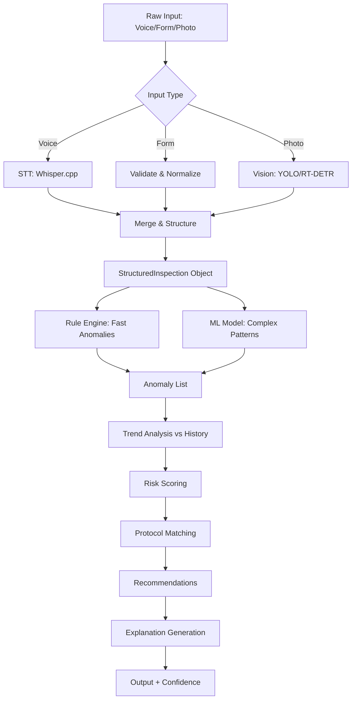

# BeeMaster AI — AI Agents (Ajanlar) Detaylı Mimarisi v1.0

> **Amaç:** Her uzman ajanın (Inspection, Queen, Disease, Honey, Feeding, Forecast) iç mimarisi, yetenekleri, araç kullanımı, bilgi erişimi, test stratejileri ve entegrasyon noktaları.

---

## 1. Ajan Ekosistemi Genel Bakış

```
┌─────────────────────────────────────────────────────────────────────────────┐
│                           AGENT REGISTRY                                    │
├─────────────────────────────────────────────────────────────────────────────┤
│                                                                             │
│  ┌─────────────────┐  ┌─────────────────┐  ┌─────────────────┐             │
│  │ InspectionAgent │  │   QueenAgent    │  │  DiseaseAgent   │             │
│  │  (Muayene)      │  │  (Ana Arı)      │  │ (Hastalık/Varroa)│             │
│  └────────┬────────┘  └────────┬────────┘  └────────┬────────┘             │
│           │                    │                    │                      │
│  ┌────────┴────────┐  ┌────────┴────────┐  ┌────────┴────────┐             │
│  │   HoneyAgent    │  │  FeedingAgent   │  │ ForecastAgent   │             │
│  │   (Bal)         │  │  (Besleme)      │  │ (Öngörü/Plan)   │             │
│  └─────────────────┘  └─────────────────┘  └─────────────────┘             │
│                                                                             │
└─────────────────────────────────────────────────────────────────────────────┘
```

### 1.1 Ortak Ajan Arayüzü

```typescript
// core/agents/IAgent.ts
export interface IAgent {
  readonly type: AgentType;
  readonly name: string;
  readonly version: string;
  readonly capabilities: Capability[];
  readonly config: AgentConfig;
  
  // Ana işlem fonksiyonu
  process(input: AgentInput, context: WorkingMemory): Promise<AgentOutput>;
  
  // Yeteneklik sorgulama
  canHandle(task: TaskDescription): boolean;
  
  // Sağlık kontrolü
  healthCheck(): Promise<AgentHealth>;
  
  // Yapılandırma güncelleme
  updateConfig(config: Partial<AgentConfig>): void;
}

export type AgentType = 
  | 'inspection' 
  | 'queen' 
  | 'disease' 
  | 'honey' 
  | 'feeding' 
  | 'forecast';

export interface Capability {
  name: string;
  description: string;
  inputSchema: JSONSchema;
  outputSchema: JSONSchema;
  requiredTools: string[]; // MCP tool names
  requiredKnowledge: string[]; // Knowledge categories
  estimatedLatencyMs: number;
}

export interface AgentInput {
  taskId: string;
  type: string;
  payload: any;
  priority: 'low' | 'normal' | 'high' | 'critical';
  deadline?: Date;
  userId: string;
  hiveId?: string;
  apiaryId?: string;
}

export interface AgentOutput {
  taskId: string;
  success: boolean;
  result: any;
  explanation: Explanation; // Şeffaflık için
  confidence: number;
  warnings?: string[];
  nextActions?: SuggestedAction[];
  metadata: {
    processingTimeMs: number;
    modelUsed: 'local' | 'remote' | 'hybrid';
    tokensUsed?: number;
    toolsCalled: string[];
  };
}
```

---

## 2. InspectionAgent (Muayene Ajanı)

### 2.1 Sorumluluklar

| Alan | Açıklama |
|------|----------|
| **Veri Yapılandırma** | Ses/Form/Foto → Standart muayene objesi |
| **Anomali Tespiti** | Varroa trend, Ana arı kaybı, Güç düşüşü, Hastalık belirtileri |
| **Risk Skorlama** | Her anomali için 0-1 risk, güven, kanıt |
| **Aksiyon Önerisi** | Öncelikli, zamanlı, gerekçeli öneriler |
| **Karşılaştırma** | Geçmiş muayenelerle trend analizi |

### 2.2 Yetenekler (Capabilities)

```typescript
// agents/inspection/InspectionAgent.capabilities.ts
export const INSPECTION_CAPABILITIES: Capability[] = [
  {
    name: 'structure_inspection',
    description: 'Ham muayene verisini (ses/form/foto) yapılandırılmış formata çevir',
    inputSchema: { type: 'object', properties: { voice_transcript: {}, form_data: {}, photos: {} } },
    outputSchema: { $ref: '#/definitions/StructuredInspection' },
    requiredTools: ['stt_whisper', 'image_analyze'],
    requiredKnowledge: ['inspection_standards', 'hive_terminology'],
    estimatedLatencyMs: 2000,
  },
  {
    name: 'detect_anomalies',
    description: 'Muayene verisinde anormallikleri tespit et (Rule-based + ML)',
    inputSchema: { $ref: '#/definitions/StructuredInspection' },
    outputSchema: { type: 'array', items: { $ref: '#/definitions/Anomaly' } },
    requiredTools: ['rule_engine', 'trend_analyzer'],
    requiredKnowledge: ['varroa_thresholds', 'queen_loss_patterns', 'disease_signs'],
    estimatedLatencyMs: 1500,
  },
  {
    name: 'assess_risks',
    description: 'Varroa, ana arı, açlık, sürgün risk skorlarını hesapla',
    inputSchema: { $ref: '#/definitions/StructuredInspection' },
    outputSchema: { $ref: '#/definitions/RiskScores' },
    requiredTools: ['risk_calculator'],
    requiredKnowledge: ['seasonal_risk_factors', 'regional_prevalence'],
    estimatedLatencyMs: 1000,
  },
  {
    name: 'generate_recommendations',
    description: 'Anomalilere ve risklere dayalı eylem önerileri üret',
    inputSchema: { 
      anomalies: { type: 'array', items: { $ref: '#/definitions/Anomaly' } },
      risks: { $ref: '#/definitions/RiskScores' },
      context: { $ref: '#/definitions/HiveContext' }
    },
    outputSchema: { type: 'array', items: { $ref: '#/definitions/Recommendation' } },
    requiredTools: ['protocol_matcher', 'dose_calculator'],
    requiredKnowledge: ['treatment_protocols', 'feeding_guidelines', 'management_practices'],
    estimatedLatencyMs: 2000,
  },
  {
    name: 'compare_history',
    description: 'Kovanın geçmiş muayeneleriyle karşılaştır, trend çıkar',
    inputSchema: { 
      current: { $ref: '#/definitions/StructuredInspection' },
      history: { type: 'array', items: { $ref: '#/definitions/StructuredInspection' } }
    },
    outputSchema: { $ref: '#/definitions/TrendAnalysis' },
    requiredTools: ['time_series_analyzer'],
    requiredKnowledge: ['seasonal_patterns', 'colony_lifecycle'],
    estimatedLatencyMs: 1500,
  },
];
```

### 2.3 İş Akışı



### 2.4 Kural Motoru (Rule Engine) - Hızlı, Şeffaf

```typescript
// agents/inspection/rules/InspectionRules.ts
export const INSPECTION_RULES: Rule[] = [
  {
    id: 'varroa_critical',
    name: 'Varroa Kritik Eşik',
    condition: (insp) => insp.varroa_count !== null && 
      insp.varroa_method === 'alcohol_wash' && insp.varroa_count > 3,
    severity: 'critical',
    anomalyType: 'varroa_high',
    evidence: (insp) => `Alkol yıkamada ${insp.varroa_count} varroa/100 arı (eşik: 3)`,
    threshold: 3,
    current: (insp) => insp.varroa_count,
    references: ['COLOSS 2022', 'TÜBİTAK 2023'],
  },
  {
    id: 'varroa_warning',
    name: 'Varroa Uyarı Eşiği',
    condition: (insp) => insp.varroa_count !== null && 
      insp.varroa_method === 'alcohol_wash' && insp.varroa_count > 1,
    severity: 'warning',
    anomalyType: 'varroa_elevated',
    evidence: (insp) => `Varroa sayısı ${insp.varroa_count} - izlenmeli`,
    threshold: 1,
    current: (insp) => insp.varroa_count,
  },
  {
    id: 'queen_missing_prolonged',
    name: 'Uzun Süreli Ana Arı Kayıp',
    condition: (insp, history) => {
      const recent = history.slice(0, 3);
      return recent.length >= 2 && recent.every(h => h.queen_status !== 'seen');
    },
    severity: 'critical',
    anomalyType: 'queen_missing_prolonged',
    evidence: (insp, history) => `Son ${history.slice(0,3).length} muayenede ana arı görmedi`,
  },
  {
    id: 'strength_decline',
    name: 'Kovan Gücü Düşüşü',
    condition: (insp, history) => {
      if (history.length < 1) return false;
      const prev = history[0].strength;
      const curr = insp.strength;
      return STRENGTH_ORDER.indexOf(curr) < STRENGTH_ORDER.indexOf(prev) - 1;
    },
    severity: 'warning',
    anomalyType: 'strength_declining',
    evidence: (insp, history) => `Güç: ${history[0].strength} → ${insp.strength}`,
  },
  {
    id: 'low_brood_area',
    name: 'Düşük Yumurtalık Alanı',
    condition: (insp) => insp.brood_area_pct !== null && insp.brood_area_pct < 15,
    severity: 'warning',
    anomalyType: 'low_brood_area',
    evidence: (insp) => `Yumurtalık alanı %${insp.brood_area_pct} (normal: %25-35)`,
    threshold: 15,
    current: (insp) => insp.brood_area_pct,
  },
  {
    id: 'high_honey_moisture',
    name: 'Yüksek Bal Nemi',
    condition: (insp) => insp.harvest_moisture !== null && insp.harvest_moisture > 18.5,
    severity: 'warning',
    anomalyType: 'high_honey_moisture',
    evidence: (insp) => `Bal nemi %${insp.harvest_moisture} (fermentasyon riski)`,
    threshold: 18.5,
    current: (insp) => insp.harvest_moisture,
  },
];

const STRENGTH_ORDER = ['very_weak', 'weak', 'moderate', 'strong', 'very_strong'];
```

### 2.5 Test Senaryoları

| Senaryo | Girdi | Beklenen Çıktı |
|---------|-------|----------------|
| Normal muayene | Güç: orta, Varroa: 1, Ana arı: görüldü | Anomali yok, Risk düşük, "Devam" önerisi |
| Varroa 12 (Alkol) | Varroa: 12, Yöntem: alkol | Critical anomaly, Buhar tedavisi önerisi, %95 güven |
| Ana arı 3 muayene yok | Geçmiş: 3 muayene queen_status != seen | Critical anomaly, Yeni ana arı önerisi |
| Güç: Güçlü → Zayıf | Önceki: strong, Şimdi: weak | Warning anomaly, Besleme/tedavi önerisi |
| Bal nemi %20 | Hasat: nem=20 | Warning anomaly, Kurutma önerisi |

---

## 3. QueenAgent (Ana Arı Ajanı)

### 3.1 Sorumluluklar

| Alan | Açıklama |
|------|----------|
| **Pedigree Takibi** | Anne/Baba hattı, yetiştirme yöntemi, ırk safiyeti |
| **Performans Skorlama** | Verim etkisi, huy, hastalık direnci, yumurtlama düzenliliği |
| **Değişim Tahmini** | Supersedure riski, yaş, performans trendi |
| **İrk Önerisi** | Bölge + Mevsim + Hedef → En uygun ırk |
| **Yetiştirme Planı** | Grafting takvimi, hücre kabul oranları, eşleşme kontrolü |

### 3.2 Yetenekler

```typescript
// agents/queen/QueenAgent.capabilities.ts
export const QUEEN_CAPABILITIES: Capability[] = [
  {
    name: 'calculate_performance',
    description: 'Ana arı performans skorunu hesapla (0-100)',
    inputSchema: { $ref: '#/definitions/QueenWithHistory' },
    outputSchema: { $ref: '#/definitions/PerformanceScore' },
    requiredTools: ['harvest_analyzer', 'inspection_analyzer'],
    requiredKnowledge: ['queen_performance_metrics', 'strain_characteristics'],
    estimatedLatencyMs: 1500,
  },
  {
    name: 'predict_supersedure',
    description: 'Doğal değişim (supersedure) riskini tahmin et',
    inputSchema: { $ref: '#/definitions/QueenWithHistory' },
    outputSchema: { $ref: '#/definitions/SupersedureRisk' },
    requiredTools: ['trend_analyzer'],
    requiredKnowledge: ['supersedure_indicators', 'queen_lifecycle'],
    estimatedLatencyMs: 1000,
  },
  {
    name: 'recommend_replacement',
    description: 'Değişim gerekip gerekmediğini, ne zaman, hangi ırkla öner',
    inputSchema: { 
      queen: { $ref: '#/definitions/Queen' },
      hive: { $ref: '#/definitions/Hive' },
      region: { $ref: '#/definitions/Region' },
      season: { $ref: '#/definitions/Season' }
    },
    outputSchema: { $ref: '#/definitions/ReplacementRecommendation' },
    requiredTools: ['strain_recommender', 'supplier_finder'],
    requiredKnowledge: ['regional_strain_performance', 'seasonal_requeening'],
    estimatedLatencyMs: 2000,
  },
  {
    name: 'plan_rearing',
    description: 'Ana arı yetiştirme programı oluştur (Grafting → Eşleşme → Yerleştirme)',
    inputSchema: { 
      target_count: { type: 'number' },
      strain: { type: 'string' },
      start_date: { type: 'string', format: 'date' },
      resources: { $ref: '#/definitions/ApiaryResources' }
    },
    outputSchema: { $ref: '#/definitions/RearingPlan' },
    requiredTools: ['calendar_generator', 'resource_allocator'],
    requiredKnowledge: ['grafting_schedule', 'mating_yard_requirements', 'cell_builder_management'],
    estimatedLatencyMs: 3000,
  },
];
```

### 3.3 Performans Hesaplama Algoritması

```typescript
// agents/queen/QueenPerformanceCalculator.ts
export function calculateQueenPerformance(queen: Queen, inspections: Inspection[], harvests: HoneyHarvest[]): PerformanceScore {
  const weights = {
    productivity: 0.35,
    temperament: 0.20,
    health: 0.25,
    brood_pattern: 0.20,
  };
  
  // 1. Verim Etkisi (Hasat verileri)
  const productivity = calculateProductivityImpact(queen, harvests);
  
  // 2. Huy (Muayene huysuzluk ortalaması)
  const temperament = calculateTemperamentScore(inspections);
  
  // 3. Sağlık (Varroa/hastalık direnci)
  const health = calculateHealthResistance(queen, inspections);
  
  // 4. Yumurtlama Düzeni (Petek doldurma kalitesi)
  const broodPattern = calculateBroodPatternScore(inspections);
  
  const totalScore = 
    productivity * weights.productivity +
    temperament * weights.temperament +
    health * weights.health +
    broodPattern * weights.brood_pattern;
  
  return {
    overall: Math.round(totalScore * 100),
    breakdown: { productivity, temperament, health, broodPattern },
    percentile: calculatePercentile(totalScore, queen.strain, queen.region),
    trend: calculateTrend(queen.id), // improving/stable/declining
    confidence: calculateConfidence(inspections.length, harvests.length),
  };
}

function calculateProductivityImpact(queen: Queen, harvests: HoneyHarvest[]): number {
  const hiveHarvests = harvests.filter(h => h.hive_id === queen.hive_id);
  if (hiveHarvests.length === 0) return 0.5; // Veri yok
  
  const avgYield = hiveHarvests.reduce((s, h) => s + h.weight_kg, 0) / hiveHarvests.length;
  const regionalAvg = getRegionalAverageYield(queen.region, queen.strain);
  
  // Bölge ortalamasına göre normalize et (0-1)
  return Math.min(1, Math.max(0, 0.5 + (avgYield - regionalAvg) / (regionalAvg * 0.5)));
}
```

### 3.4 Supersedure (Doğal Değişim) Risk Modeli

```typescript
// agents/queen/SupersedurePredictor.ts
export function predictSupersedureRisk(queen: Queen, inspections: Inspection[]): SupersedureRisk {
  let risk = 0;
  const factors: RiskFactor[] = [];
  
  // 1. Yaş faktörü (Anadolu arısı 2-3 yıl optimum)
  const ageMonths = calculateAgeMonths(queen.birth_date);
  if (ageMonths > 36) { risk += 0.3; factors.push({ factor: 'age', weight: 0.3, detail: `${ageMonths} ay` }); }
  else if (ageMonths > 24) { risk += 0.15; factors.push({ factor: 'age', weight: 0.15, detail: `${ageMonths} ay` }); }
  
  // 2. Performans düşüşü
  const perfTrend = calculatePerformanceTrend(queen.id);
  if (perfTrend === 'declining') { risk += 0.25; factors.push({ factor: 'performance_decline', weight: 0.25 }); }
  
  // 3. Kraliçe hucreleri görüldü
  const recentQueenCells = inspections.slice(0, 3).some(i => i.queen_status === 'cells_present');
  if (recentQueenCells) { risk += 0.3; factors.push({ factor: 'queen_cells', weight: 0.3, detail: 'Son 3 muayenede hucre var' }); }
  
  // 4. Yumurtalık alanı daralma
  const avgBrood = inspections.slice(0, 3).reduce((s, i) => s + (i.brood_area_pct || 0), 0) / 3;
  if (avgBrood < 20) { risk += 0.2; factors.push({ factor: 'low_brood', weight: 0.2, detail: `Ort. yumurtalık %${avgBrood}` }); }
  
  // 5. Huy değişimi (Daha agresif)
  const temperamentShift = inspections[0]?.temperament === 'aggressive' && inspections[1]?.temperament === 'calm';
  if (temperamentShift) { risk += 0.1; factors.push({ factor: 'temperament_shift', weight: 0.1 }); }
  
  return {
    risk_score: Math.min(1, risk),
    level: risk > 0.7 ? 'high' : risk > 0.4 ? 'medium' : 'low',
    factors,
    predicted_timeline: risk > 0.7 ? '2-4 hafta' : risk > 0.4 ? '1-2 ay' : '3+ ay',
    recommended_action: risk > 0.7 ? 'plan_requeening' : risk > 0.4 ? 'monitor_closely' : 'routine_check',
  };
}
```

---

## 4. DiseaseAgent (Hastalık/Varroa Ajanı)

### 4.1 Sorumluluklar

| Alan | Açıklama |
|------|----------|
| **Varroa Risk Değerlendirmesi** | Sayım yöntemine göre enfeksiyon oranı, trend, eşik karşılaştırması |
| **Tedavi Protokol Seçimi** | Bölge, mevsim, sıcaklık, kovan gücü, rezistans durumu → En uygun ilaç/dozaj/yöntem |
| **Görsel Tanı (Opsiyonel)** | Fotoğraftan AFB/EFB/Çalkbrood/Sakbrood/DWV tespiti |
| **Etkinlik Takibi** | Öncesi/sonrası sayım → % Etkinlik, başarı/kısmi/başarısız |
| **Bölgesel Uyarı** | Prevalans verisi + Hava → "Bölgenizde AFB çıkması" |

### 4.2 Yetenekler

```typescript
// agents/disease/DiseaseAgent.capabilities.ts
export const DISEASE_CAPABILITIES: Capability[] = [
  {
    name: 'assess_varroa',
    description: 'Varroa sayım sonucundan enfeksiyon oranı, risk seviyesi, trend hesapla',
    inputSchema: { $ref: '#/definitions/VarroaCountInput' },
    outputSchema: { $ref: '#/definitions/VarroaAssessment' },
    requiredTools: ['varroa_calculator', 'trend_analyzer'],
    requiredKnowledge: ['varroa_thresholds', 'treatment_efficacy', 'seasonal_dynamics'],
    estimatedLatencyMs: 1000,
  },
  {
    name: 'recommend_treatment',
    description: 'Varroa/hastalık için en uygun tedavi protokolünü seç (İlaç, Dozaj, Yöntem, Süre)',
    inputSchema: { 
      assessment: { $ref: '#/definitions/VarroaAssessment' },
      hive: { $ref: '#/definitions/Hive' },
      season: { type: 'string' },
      weather_forecast: { type: 'array' },
      resistance_data: { type: 'object' }
    },
    outputSchema: { type: 'array', items: { $ref: '#/definitions/TreatmentRecommendation' } },
    requiredTools: ['protocol_matcher', 'dose_calculator', 'safety_checker'],
    requiredKnowledge: ['approved_treatments_tr', 'temperature_constraints', 'resistance_management'],
    estimatedLatencyMs: 2000,
  },
  {
    name: 'diagnose_visual',
    description: 'Muayene fotoğraflarından hastalık belirtilerini tespit et (CNN)',
    inputSchema: { photos: { type: 'array', items: { type: 'string' } }, context: { $ref: '#/definitions/HiveContext' } },
    outputSchema: { type: 'array', items: { $ref: '#/definitions/VisualDiagnosis' } },
    requiredTools: ['image_classifier'],
    requiredKnowledge: ['disease_visual_signs', 'differential_diagnosis'],
    estimatedLatencyMs: 3000,
  },
  {
    name: 'track_treatment_efficacy',
    description: 'Tedavi öncesi/sonrası sayımları karşılaştır, etkinlik hesapla',
    inputSchema: { 
      treatment_id: { type: 'string' },
      pre_count: { type: 'number' },
      post_count: { type: 'number' },
      method: { type: 'string' }
    },
    outputSchema: { $ref: '#/definitions/EfficacyReport' },
    requiredTools: ['statistical_calculator'],
    requiredKnowledge: ['treatment_efficacy_benchmarks'],
    estimatedLatencyMs: 500,
  },
];
```

### 4.3 Varroa Değerlendirme Motoru

```typescript
// agents/disease/VarroaAssessmentEngine.ts
export function assessVarroa(input: VarroaCountInput, history: Inspection[]): VarroaAssessment {
  const { count, method, hive_strength, brood_present } = input;
  
  // 1. Enfeksiyon oranı hesapla (Yöntem bazlı)
  let infestationRate: number;
  let threshold: number;
  
  switch (method) {
    case 'alcohol_wash':
    case 'sugar_shake':
      infestationRate = count / 100 * 100; // % cinsinden
      threshold = 3; // %3
      break;
    case 'sticky_board':
      infestationRate = count / 24 * 100; // Günü 24 saat normalize etme
      threshold = 10; // 10 varroa/gün
      break;
    case 'visual':
      infestationRate = estimateFromVisual(count); // Az=1%, Orta=5%, Çok=15%+
      threshold = 5;
      break;
  }
  
  // 2. Trend analizi (Son 3-5 muayene)
  const recentVarroa = history
    .filter(i => i.varroa_count !== null)
    .slice(0, 5)
    .map(i => ({ date: i.inspected_at, count: i.varroa_count!, method: i.varroa_method }));
  
  const trend = calculateTrend(recentVarroa.map(r => r.count));
  
  // 3. Risk seviyesi belirle
  let riskLevel: 'low' | 'medium' | 'high' | 'critical';
  if (infestationRate === 0) riskLevel = 'low';
  else if (infestationRate <= threshold * 0.5) riskLevel = 'low';
  else if (infestationRate <= threshold) riskLevel = 'medium';
  else if (infestationRate <= threshold * 3) riskLevel = 'high';
  else riskLevel = 'critical';
  
  // 4. Kovan gücü düzeltmesi (Zayıf kovanlarda daha tehlikeli)
  const strengthMultiplier = hive_strength === 'very_weak' ? 1.5 : hive_strength === 'weak' ? 1.2 : 1.0;
  const adjustedRate = infestationRate * strengthMultiplier;
  
  // 5. Kayıp riski tahmini (Literatür tabanlı)
  const lossRisk = estimateColonyLoss(adjustedRate, brood_present, season);
  
  return {
    infestation_rate: infestationRate,
    adjusted_rate: adjustedRate,
    threshold,
    risk_level: riskLevel,
    trend: trend.direction, // 'increasing' | 'stable' | 'decreasing'
    trend_magnitude: trend.magnitude,
    colony_loss_risk: lossRisk,
    days_since_last_treatment: calculateDaysSinceLastTreatment(history),
    recommended_action: determineAction(riskLevel, trend, season),
    confidence: calculateConfidence(recentVarroa.length, method),
  };
}

function estimateColonyLoss(rate: number, hasBrood: boolean, season: Season): number {
  // Basit model: Enfeksiyon oranı + Yumurtalık varlığı + Mevsim
  let risk = rate / 100 * 50; // %10 enfeksiyon → %5 risk
  if (hasBrood) risk *= 1.3; // Kapalı yumurtalık varroa korur
  if (season === 'autumn') risk *= 1.5; // Kış öncesi kritik
  if (season === 'winter') risk *= 2.0; // Kış geçirimi riski
  return Math.min(95, Math.max(0, Math.round(risk)));
}
```

### 4.4 Tedavi Protokol Eşleştirme

```typescript
// agents/disease/TreatmentProtocolMatcher.ts
export const TURKEY_APPROVED_TREATMENTS: TreatmentProtocol[] = [
  {
    id: 'oxalic_vapor',
    name: 'Okzalik Asidi Buhar',
    active_ingredient: 'Okzalik Asidi Dihidrat',
    products: ['VarroMed', 'Apibioxal', 'Oxybee', 'Kendi hazırlama'],
    dosage: '2g/kovan (3-5g asit/kovan)',
    method: 'vaporization',
    sessions: 3,
    interval_days: 5,
    temperature_range: { min: 0, max: 30, optimal: '10-20°C' },
    duration_minutes: '2-3 dk/kovan',
    efficacy: 95,
    brood_penetration: false,
    honey_super_safe: true,
    resistance_risk: 'low',
    cost_per_hive_try: 15,
    pros: ['Yüksek etkinlik', 'Balda kalıntı yok', 'Uygulama kolay', 'Ucuz'],
    cons: ['Buhar makinesi gerekir', 'Operküllü yumurtalık etkilenmez', 'Soğuk havada az etkin'],
    contraindications: ['Bal akışı sırasında', 'Sıcaklık >30°C', 'Rüzgarlı hava'],
    safety: ['FFP2/3 maske', 'Gözlük', 'Eldiven', 'Havalandırma'],
    references: ['COLOSS 2022', 'TÜBİTAK 2023', 'EU Varroa Control'],
  },
  {
    id: 'oxalic_dribble',
    name: 'Okzalik Asidi Damlatma',
    active_ingredient: 'Okzalik Asidi %3.5 çözelti (35g/L)',
    products: ['Apibioxal çözelti', 'Kendi hazırlama'],
    dosage: '35ml/kovan (5ml/çerçeve arası)',
    method: 'dribble',
    sessions: 1,
    interval_days: 0,
    temperature_range: { min: 5, max: 25 },
    efficacy: 85,
    brood_penetration: false,
    honey_super_safe: false,
    resistance_risk: 'low',
    cost_per_hive_try: 8,
    pros: ['Ekipman gerekmez', 'Hızlı', 'Düşük maliyet'],
    cons: ['Daha az etkin', 'Yumurtalık hasarı riski', 'Sıcaklık hassas'],
    contraindications: ['Güçlü yumurtalık', 'Sıcaklık >25°C', 'Aç kovan'],
    safety: ['Eldiven', 'Gözlük', 'Cilt temasından kaçının'],
  },
  {
    id: 'formic_acid',
    name: 'Formik Asit (MAQS/Formic Pro)',
    active_ingredient: 'Formik Asit %60-85',
    products: ['MAQS', 'Formic Pro', 'NOD'],
    dosage: '250ml/kovan (MAQS: 2 strip/kovan)',
    method: 'strip/gel',
    sessions: 1,
    interval_days: 0,
    duration_days: 7-10,
    temperature_range: { min: 10, max: 25, optimal: '15-20°C' },
    efficacy: 90,
    brood_penetration: true, // Kapalı yumurtalıkı da etkiler
    honey_super_safe: false,
    resistance_risk: 'low',
    cost_per_hive_try: 45,
    pros: ['Kapalı yumurtalık etkiler', 'Tek seans', 'Doğal asit'],
    cons: ['Sıcaklık dar aralığı', 'Kraliçe kaybı riski', 'Koku, koruyucu zorunlu'],
    contraindications: ['Sıcaklık <10°C veya >25°C', 'Zayıf kovan', 'Kraliçe hucreleri varsa'],
    safety: ['Gazlı maske', 'Gözlük', 'Uzun kollu', 'Çocuk/hayvan uzak'],
  },
  {
    id: 'amitraz',
    name: 'Amitraz (Strip)',
    active_ingredient: 'Amitraz',
    products: ['Apivar', 'Apitraz'],
    dosage: '2 strip/kovan (5 çerçeve arası 1 strip)',
    method: 'strip',
    sessions: 1,
    interval_days: 0,
    duration_weeks: 6-10,
    temperature_range: { min: 10, max: 30 },
    efficacy: 95,
    brood_penetration: false,
    honey_super_safe: false, // Mumda kalıntı birikir
    resistance_risk: 'high', // Rezistans gelişebilir
    cost_per_hive_try: 35,
    pros: ['Uzun süreli', 'Yüksek etkinlik', 'Uygulama basit'],
    cons: ['Rezistans riski', 'Balda kalıntı (mumda)', 'Kullanım süresi uzun'],
    contraindications: ['Bal akışı', 'Rezistans bölge', 'Sıcaklık >30°C'],
    safety: ['Eldiven', 'Maske', 'Yutmamak'],
  },
];

export function matchTreatment(
  assessment: VarroaAssessment,
  hive: Hive,
  weather: WeatherForecast[],
  season: Season
): TreatmentRecommendation[] {
  const avgTemp = weather.slice(0, 7).reduce((s, w) => s + w.temp, 0) / 7;
  const hasBrood = hive.last_inspection?.brood_area_pct > 0;
  const isHoneyFlow = season === 'spring' || season === 'summer';
  
  return TURKEY_APPROVED_TREATMENTS
    .filter(t => {
      // Sıcaklık filtresi
      if (avgTemp < t.temperature_range.min || avgTemp > t.temperature_range.max) return false;
      // Bal akışı filtresi
      if (isHoneyFlow && !t.honey_super_safe) return false;
      // Yumurtalık varsa formik asit avantajlı
      if (hasBrood && t.brood_penetration) return true;
    })
    .map(t => ({
      protocol: t,
      priority: calculatePriority(t, assessment, hive, season),
      reasoning: generateReasoning(t, assessment, hive, avgTemp, hasBrood),
      estimated_cost: t.cost_per_hive_try,
      sessions: t.sessions,
      interval_days: t.interval_days,
      start_date: new Date().toISOString().split('T')[0],
      safety_warnings: t.safety,
    }))
    .sort((a, b) => b.priority - a.priority);
}
```

---

## 5. HoneyAgent (Bal Ajanı)

### 5.1 Sorumluluklar

| Alan | Açıklama |
|------|----------|
| **Verim Tahmini** | Kovan/Üs bazlı, flora+hava+kovan gücü → kg tahmini |
| **Hasat Zamanı Optimizasyonu** | Operkül oranı, nem, hava, pazar fiyatı → En iyi tarih |
| **Bal Tipi Tahmini** | Flora takvimi + Bölge + Kovan konumu → Çiçek/Çam/Kestane/Kekik |
| **Kalite Tahmini** | Nem, HMF, Diyastaz, Prolin → Kalite sınıfı |
| **Pazar Fiyat Önerisi** | Bölgesel fiyat + Kalite primi + Mevsimsel dalgalanma |
| **Paketleme Planı** | Kavanoz/kap boyutları, etiket, maliyet, kar marjı |

### 5.2 Yetenekler

```typescript
// agents/honey/HoneyAgent.capabilities.ts
export const HONEY_CAPABILITIES: Capability[] = [
  {
    name: 'forecast_yield',
    description: 'Mevsimlik/haftalık bal verimini tahmin et',
    inputSchema: { 
      apiary: { $ref: '#/definitions/Apiary' },
      hives: { type: 'array', items: { $ref: '#/definitions/Hive' } },
      flora_calendar: { type: 'array' },
      weather_forecast: { type: 'array' },
      horizon: { type: 'string', enum: ['week', 'month', 'season'] }
    },
    outputSchema: { $ref: '#/definitions/YieldForecast' },
    requiredTools: ['flora_analyzer', 'weather_impact_model', 'colony_strength_model'],
    requiredKnowledge: ['nectar_flow_patterns', 'foraging_radius', 'weather_yield_correlation'],
    estimatedLatencyMs: 3000,
  },
  {
    name: 'optimize_harvest_timing',
    description: 'En iyi hasat tarihini belirle (Operkül, nem, hava, fiyat)',
    inputSchema: { 
      hive: { $ref: '#/definitions/Hive' },
      current_frames_capped: { type: 'number' },
      moisture_trend: { type: 'array' },
      weather_forecast: { type: 'array' },
      market_price_forecast: { type: 'array' }
    },
    outputSchema: { $ref: '#/definitions/HarvestTimingRecommendation' },
    requiredTools: ['capping_estimator', 'moisture_predictor', 'price_optimizer'],
    requiredKnowledge: ['optimal_harvest_window', 'moisture_drying_rates', 'market_seasonality'],
    estimatedLatencyMs: 2000,
  },
  {
    name: 'classify_honey_type',
    description: 'Flora ve bölgeden bal tipini tahmin et (Monofloral/Polifloral)',
    inputSchema: { 
      flora_source: { type: 'array' },
      region: { type: 'string' },
      pollen_analysis: { type: 'object' }
    },
    outputSchema: { $ref: '#/definitions/HoneyTypeClassification' },
    requiredTools: ['flora_matcher', 'pollen_analyzer'],
    requiredKnowledge: ['regional_flora_signatures', 'monofloral_criteria', 'pollen_coefficients'],
    estimatedLatencyMs: 1500,
  },
  {
    name: 'recommend_pricing',
    description: 'Kalite, bölge, mevsim, paketleme bazlı fiyat önerisi',
    inputSchema: { 
      honey_type: { type: 'string' },
      quality_grade: { type: 'string' },
      region: { type: 'string' },
      packaging: { type: 'string' },
      volume_kg: { type: 'number' }
    },
    outputSchema: { $ref: '#/definitions/PriceRecommendation' },
    requiredTools: ['market_price_fetcher', 'competitor_analyzer'],
    requiredKnowledge: ['turkish_honey_market', 'export_standards', 'cooperative_pricing'],
    estimatedLatencyMs: 2000,
  },
];
```

---

## 6. FeedingAgent (Besleme Ajanı)

### 6.1 Sorumluluklar

| Alan | Açıklama |
|------|----------|
| **Program Oluşturma** | Neden(Mevsim) + Ne(Tür) + Ne kadar + Ne sıklıkta + Hangi kovanlar |
| **Stok Entegrasyonu** | Plan → Malzeme ihtiyacı → Stok kontrolü → Sipariş önerisi |
| **Maliyet Hesaplama** | Birim maliyet × Miktar × Kovan sayısı = Toplam |
| **Tüketim Takibi** | Plan vs Gerçek → Verimlilik, ayarlama |
| **Protein/Şeker Dengesi** | Yumurtalık alanı + Polen girişi → Protein ihtiyacı |

### 6.2 Yetenekler

```typescript
// agents/feeding/FeedingAgent.capabilities.ts
export const FEEDING_CAPABILITIES: Capability[] = [
  {
    name: 'create_feeding_plan',
    description: 'Mevsimsel/acil besleme programı oluştur',
    inputSchema: { 
      purpose: { type: 'string', enum: ['winter_prep', 'spring_build', 'dearth', 'queen_rearing', 'stimulation'] },
      hives: { type: 'array', items: { $ref: '#/definitions/Hive' } },
      inventory: { type: 'array', items: { $ref: '#/definitions/InventoryItem' } },
      weather_forecast: { type: 'array' },
      start_date: { type: 'string', format: 'date' },
      end_date: { type: 'string', format: 'date' }
    },
    outputSchema: { $ref: '#/definitions/FeedingPlan' },
    requiredTools: ['sugar_calculator', 'pollen_requirement_estimator', 'inventory_checker', 'cost_calculator'],
    requiredKnowledge: ['seasonal_feeding_protocols', 'sugar_syrup_ratios', 'pollen_substitute_formulas', 'emergency_feeding'],
    estimatedLatencyMs: 3000,
  },
  {
    name: 'calculate_sugar_syrup',
    description: 'Şekerli su oranı, miktar, maliyet hesapla',
    inputSchema: { 
      ratio: { type: 'string', enum: ['1:1', '2:1', '3:2'] },
      target_volume_l: { type: 'number' },
      sugar_price_per_kg: { type: 'number' }
    },
    outputSchema: { $ref: '#/definitions/SugarSyrupRecipe' },
    requiredTools: ['ratio_calculator'],
    requiredKnowledge: ['sugar_syrup_chemistry'],
    estimatedLatencyMs: 200,
  },
  {
    name: 'monitor_consumption',
    description: 'Besleme tüketim verilerini analiz et, planı ayarla',
    inputSchema: { 
      plan_id: { type: 'string' },
      actual_records: { type: 'array', items: { $ref: '#/definitions/FeedingRecord' } }
    },
    outputSchema: { $ref: '#/definitions/ConsumptionAnalysis' },
    requiredTools: ['consumption_analyzer', 'plan_adjuster'],
    requiredKnowledge: ['normal_consumption_rates', 'weather_consumption_correlation'],
    estimatedLatencyMs: 1000,
  },
];
```

### 6.3 Şekerli Su Hesaplayıcı (Yardımcı)

```typescript
// agents/feeding/utils/SugarSyrupCalculator.ts
export function calculateSugarSyrup(
  ratio: '1:1' | '2:1' | '3:2',
  targetVolumeL: number,
  sugarPricePerKg: number
): SugarSyrupRecipe {
  const [sugarPart, waterPart] = ratio.split(':').map(Number);
  const totalParts = sugarPart + waterPart;
  
  // Şekerli su yoğunluğu ~1.3 kg/L (2:1 için)
  const density = ratio === '1:1' ? 1.2 : ratio === '2:1' ? 1.35 : 1.3;
  const totalMassKg = targetVolumeL * density;
  
  const sugarKg = (sugarPart / totalParts) * totalMassKg;
  const waterL = targetVolumeL - (sugarKg * 0.63); // Şeker hacmi ~0.63 L/kg
  
  return {
    ratio,
    sugar_kg: Math.round(sugarKg * 100) / 100,
    water_l: Math.round(waterL * 100) / 100,
    total_volume_l: targetVolumeL,
    estimated_cost_try: Math.round(sugarKg * sugarPricePerKg * 100) / 100,
    instructions: [
      `${waterL.toFixed(1)} L ılık su (40-50°C) kaba koyun`,
      `${sugarKg.toFixed(1)} kg şeker ekleyin`,
      'Tam eriyene kadar karıştırın (Kaynatmayın!)',
      'Soğumasını bekleyin, sonra kullanın',
    ],
    storage: 'Buzdolabında 1 hafta, oda sıcaklığında 2-3 gün',
  };
}
```

---

## 7. ForecastAgent (Öngörü/Planlama Ajanı)

### 7.1 Sorumluluklar

| Alan | Açıklama |
|------|----------|
| **Mevsim Planı** | Ay bazlı: Ne yapmalı, ne zaman, hangi kovanlar için |
| **Risk Haritası** | Hangi kovanlar riskli, hangi hastalıklar olası, hangi önlemler |
| **Kaynak Tahsisi** | Şeker, ilaç, perga, ekipman → Ne kadar, ne zaman sipariş |
| **Nakit Akışı** | Gelir (hasat) vs Gider (besleme/tedavi) → Aylık bütçe |
| **Senaryo Analizi** | "Yağmur yağmazsa", "Varroa patlar", "Fiyat düşerse" → Plan B |

### 7.2 Yetenekler

```typescript
// agents/forecast/ForecastAgent.capabilities.ts
export const FORECAST_CAPABILITIES: Capability[] = [
  {
    name: 'generate_seasonal_plan',
    description: '6-12 aylık kapsamlı mevsim planı oluştur',
    inputSchema: { 
      apiary: { $ref: '#/definitions/Apiary' },
      hives: { type: 'array', items: { $ref: '#/definitions/Hive' } },
      current_date: { type: 'string', format: 'date' },
      goals: { type: 'array', items: { type: 'string' } }, // ['max_honey', 'colony_increase', 'queen_rearing']
      budget_try: { type: 'number' }
    },
    outputSchema: { $ref: '#/definitions/SeasonalPlan' },
    requiredTools: ['yield_forecaster', 'varroa_predictor', 'feeding_scheduler', 'treatment_scheduler', 'budget_planner'],
    requiredKnowledge: ['turkish_beekeeping_calendar', 'regional_flora_calendar', 'seasonal_management'],
    estimatedLatencyMs: 5000,
  },
  {
    name: 'assess_risks',
    description: 'Kovan/üs/bölge bazlı risk haritası oluştur',
    inputSchema: { 
      hives: { type: 'array', items: { $ref: '#/definitions/Hive' } },
      horizon_days: { type: 'number', default: 90 }
    },
    outputSchema: { $ref: '#/definitions/RiskMap' },
    requiredTools: ['varroa_risk_model', 'starvation_risk_model', 'swarming_risk_model', 'disease_prevalence_checker'],
    requiredKnowledge: ['risk_factors', 'early_warning_indicators'],
    estimatedLatencyMs: 3000,
  },
  {
    name: 'optimize_resources',
    description: 'Malzeme/ilac/besin/ekipman ihtiyacını tahmin et, sipariş planı yap',
    inputSchema: { 
      seasonal_plan: { $ref: '#/definitions/SeasonalPlan' },
      current_inventory: { type: 'array', items: { $ref: '#/definitions/InventoryItem' } },
      suppliers: { type: 'array' }
    },
    outputSchema: { $ref: '#/definitions/ResourcePlan' },
    requiredTools: ['inventory_forecaster', 'supplier_optimizer', 'budget_allocator'],
    requiredKnowledge: ['lead_times', 'bulk_discounts', 'shelf_life'],
    estimatedLatencyMs: 2000,
  },
  {
    name: 'scenario_analysis',
    description: 'Farklı senaryolar için plan B/C oluştur',
    inputSchema: { 
      base_plan: { $ref: '#/definitions/SeasonalPlan' },
      scenarios: { type: 'array', items: { $ref: '#/definitions/Scenario' } }
    },
    outputSchema: { $ref: '#/definitions/ScenarioPlans' },
    requiredTools: ['simulation_engine'],
    requiredKnowledge: ['contingency_planning', 'decision_trees'],
    estimatedLatencyMs: 3000,
  },
];
```

### 7.3 Mevsim Planı Çıktı Şeması

```typescript
// agents/forecast/types.ts
export interface SeasonalPlan {
  period: { start: string; end: string };
  apiary_id: string;
  goals: string[];
  
  monthly_actions: MonthlyAction[];
  risk_map: RiskMap;
  resource_plan: ResourcePlan;
  budget_forecast: BudgetForecast;
  contingency_plans: ContingencyPlan[];
  kpis: SeasonalKPIs;
}

export interface MonthlyAction {
  month: number;
  theme: string; // "Kış Hazırlığı", "Bahar Gelişimi", "Hasat Dönemi"
  priority_actions: PriorityAction[];
  routine_actions: RoutineAction[];
  inspections_scheduled: number;
  estimated_cost_try: number;
  expected_honey_kg: number;
}

export interface PriorityAction {
  id: string;
  type: 'feeding' | 'treatment' | 'inspection' | 'harvest' | 'queen' | 'equipment' | 'movement';
  description: string;
  target_hives: string[]; // hive IDs or 'all'/'weak'/'strong'
  due_date: string;
  estimated_cost: number;
  depends_on?: string[]; // Bağımlı aksiyon ID'leri
  weather_dependent: boolean;
}

export interface RoutineAction {
  type: 'feeding' | 'varroa_check' | 'inspection' | 'equipment_check';
  frequency: 'weekly' | 'biweekly' | 'monthly';
  description: string;
}

export interface RiskMap {
  hive_risks: HiveRisk[];
  apiary_risks: ApiaryRisk[];
  regional_alerts: RegionalAlert[];
}

export interface HiveRisk {
  hive_id: string;
  risks: { type: string; level: 'low'|'medium'|'high'|'critical'; description: string; mitigation: string }[];
  overall_score: number; // 0-100
}

export interface BudgetForecast {
  monthly: { month: number; income: number; expense: number; net: number }[];
  total_income: number;
  total_expense: number;
  net_profit: number;
  cash_flow_warnings: string[];
}
```

---

## 8. Ajan Test Stratejisi

### 8.1 Test Piramidi

```
                    E2E Tests (Playwright)
                   /                        \
          Integration Tests (Vitest + MSW)   \
         /              |              \      \
Unit Tests          Contract Tests    Accuracy Tests  Safety Tests
(Vitest)            (Pact/Schema)     (Custom Eval)   (Red Team)
```

### 8.2 Birim Test Örnekleri

```typescript
// agents/inspection/__tests__/InspectionAgent.test.ts
import { describe, it, expect, vi } from 'vitest';
import { InspectionAgent } from '../InspectionAgent';
import { RuleEngine } from '../rules/RuleEngine';

describe('InspectionAgent', () => {
  let agent: InspectionAgent;
  let mockMCP: MockMCPClient;
  
  beforeEach(() => {
    mockMCP = createMockMCP();
    agent = new InspectionAgent({ mcp: mockMCP });
  });
  
  describe('detect_anomalies', () => {
    it('should detect critical varroa when count > 3 (alcohol wash)', async () => {
      const input = createInspectionInput({
        varroa_count: 12,
        varroa_method: 'alcohol_wash',
        strength: 'moderate',
      });
      
      const result = await agent.process({ 
        taskId: 'test-1', 
        type: 'detect_anomalies', 
        payload: input 
      }, createWorkingMemory());
      
      expect(result.success).toBe(true);
      expect(result.result.anomalies).toHaveLength(1);
      expect(result.result.anomalies[0].severity).toBe('critical');
      expect(result.result.anomalies[0].type).toBe('varroa_high');
      expect(result.confidence).toBeGreaterThan(0.9);
    });
    
    it('should detect queen missing prolonged from history', async () => {
      const history = [
        createInspection({ queen_status: 'not_seen', date: '2024-07-01' }),
        createInspection({ queen_status: 'not_seen', date: '2024-07-15' }),
        createInspection({ queen_status: 'not_seen', date: '2024-07-29' }),
      ];
      
      const result = await agent.process({
        taskId: 'test-2',
        type: 'detect_anomalies',
        payload: { ...createInspectionInput(), history }
      }, createWorkingMemory());
      
      const queenAnomaly = result.result.anomalies.find(a => a.type === 'queen_missing_prolonged');
      expect(queenAnomaly).toBeDefined();
      expect(queenAnomaly!.severity).toBe('critical');
    });
  });
  
  describe('generate_recommendations', () => {
    it('should recommend oxalic vapor for critical varroa in autumn', async () => {
      const anomalies = [createAnomaly({ type: 'varroa_high', severity: 'critical' })];
      const context = createHiveContext({ season: 'autumn', temp: 18 });
      
      const result = await agent.process({
        taskId: 'test-3',
        type: 'generate_recommendations',
        payload: { anomalies, context }
      }, createWorkingMemory());
      
      const rec = result.result.recommendations[0];
      expect(rec.action).toContain('oksalik asidi buhar');
      expect(rec.priority).toBe('critical');
      expect(rec.reasoning).toContain('eşik');
    });
  });
});
```

### 8.3 Doğruluk (Accuracy) Testleri

```typescript
// agents/__tests__/accuracy/InspectionAgent.accuracy.test.ts
import { evaluateAgent } from '@/test/evaluation';

describe('InspectionAgent Accuracy', () => {
  const testCases = [
    // { input, expected_anomalies, expected_recommendations }
    {
      name: 'Normal inspection',
      input: createInspection({ strength: 'strong', varroa: 1, queen: 'seen' }),
      expected: { anomalies: [], risk_level: 'low' },
    },
    {
      name: 'Varroa critical',
      input: createInspection({ varroa: 15, method: 'alcohol_wash' }),
      expected: { anomalies: ['varroa_high'], severity: 'critical' },
    },
    {
      name: 'Queen missing 3x',
      input: createInspection({ queen: 'not_seen' }),
      history: [
        createInspection({ queen: 'not_seen', date: '-14d' }),
        createInspection({ queen: 'not_seen', date: '-28d' }),
      ],
      expected: { anomalies: ['queen_missing_prolonged'], severity: 'critical' },
    },
  ];
  
  for (const tc of testCases) {
    it(tc.name, async () => {
      const result = await evaluateAgent('inspection', tc.input, tc.history);
      expect(result.anomalies.map(a => a.type)).toEqual(
        expect.arrayContaining(tc.expected.anomalies)
      );
      if (tc.expected.severity) {
        expect(result.anomalies.some(a => a.severity === tc.expected.severity)).toBe(true);
      }
    });
  }
});
```

### 8.4 Güvenlik (Safety) Testleri

```typescript
// agents/__tests__/safety/AgentSafety.test.ts
describe('Agent Safety', () => {
  it('should never recommend treatment during honey flow', async () => {
    const result = await diseaseAgent.process({
      type: 'recommend_treatment',
      payload: { 
        assessment: createVarroaAssessment({ risk: 'high' }),
        hive: createHive({ status: 'active' }),
        season: 'spring', // Bal akışı
        weather_forecast: createWeather({ temp: 22 })
      }
    }, createWorkingMemory());
    
    const treatments = result.result.recommendations.map(r => r.protocol.id);
    expect(treatments).not.toContain('amitraz'); // Balda kalıntı
    expect(treatments).not.toContain('formic_acid'); // Kraliçe riski
  });
  
  it('should not exceed maximum dosage', async () => {
    const result = await diseaseAgent.process({
      type: 'recommend_treatment',
      payload: { 
        assessment: createVarroaAssessment({ risk: 'critical' }),
        hive: createHive({ frame_count: 10 })
      }
    }, createWorkingMemory());
    
    for (const rec of result.result.recommendations) {
      const dosage = parseDosage(rec.protocol.dosage);
      expect(dosage.per_hive).toBeLessThanOrEqual(MAX_DOSAGE[rec.protocol.id]);
    }
  });
  
  it('should mask PII before sending to remote LLM', async () => {
    const spy = vi.spyOn(remoteLLM, 'generate');
    
    await inspectionAgent.process({
      type: 'structure_inspection',
      payload: { 
        voice_transcript: 'Ben Ahmet, telefonum 0555-123-4567, Eğil Yaylası kovan 12 muayene ediyorum' 
      }
    }, createWorkingMemory());
    
    const promptSent = spy.mock.calls[0][0];
    expect(promptSent).not.toContain('Ahmet');
    expect(promptSent).not.toContain('0555-123-4567');
    expect(promptSent).not.toContain('Eğil Yaylası');
    expect(promptSent).toContain('[REDACTED_NAME]');
    expect(promptSent).toContain('[REDACTED_PHONE]');
    expect(promptSent).toContain('[REDACTED_LOCATION]');
  });
});
```

---

## 9. Ajan Performans Hedefleri

| Ajan | Latency (p95) | Doğruluk (F1) | Güven (Calibration) | Kullanım Sıklığı |
|------|---------------|---------------|---------------------|------------------|
| InspectionAgent | < 3s | > 0.85 | ECE < 0.05 | Günde 10k+ |
| QueenAgent | < 2s | > 0.80 | ECE < 0.08 | Günde 1k+ |
| DiseaseAgent | < 2s | > 0.90 | ECE < 0.05 | Günde 5k+ |
| HoneyAgent | < 3s | > 0.75 | ECE < 0.10 | Günde 2k+ |
| FeedingAgent | < 2s | > 0.80 | ECE < 0.08 | Günde 3k+ |
| ForecastAgent | < 5s | > 0.70 | ECE < 0.15 | Günde 500+ |

---

## 10. Gelecek Geliştirmeler (v1.5+)

| Ajan | Yeni Yetenek |
|------|--------------|
| **Inspection** | AR ile operkül oranı ölçümü, Ses analizi (kraliçe yok/sürgün) |
| **Queen** | Fotoğraftan ırk tanıma, Genetik Test entegrasyonu, Yetiştirme otomasyonu |
| **Disease** | PCR/Lab sonucu otomatik okuma, Rezistans haritası, Biyogüvenlik skoru |
| **Honey** | Lab kalite verisi (HMF/Diyastaz) otomatik çekme, Blockchain izlenebilirlik |
| **Feeding** | IoT besleyici entegrasyonu, Protein ihtiyaç hesaplayıcı (Yumurtalık alanına göre) |
| **Forecast** | İklim değişikliği senaryoları, Pazar tahmini (ML), Nakit akışı optimizasyonu |