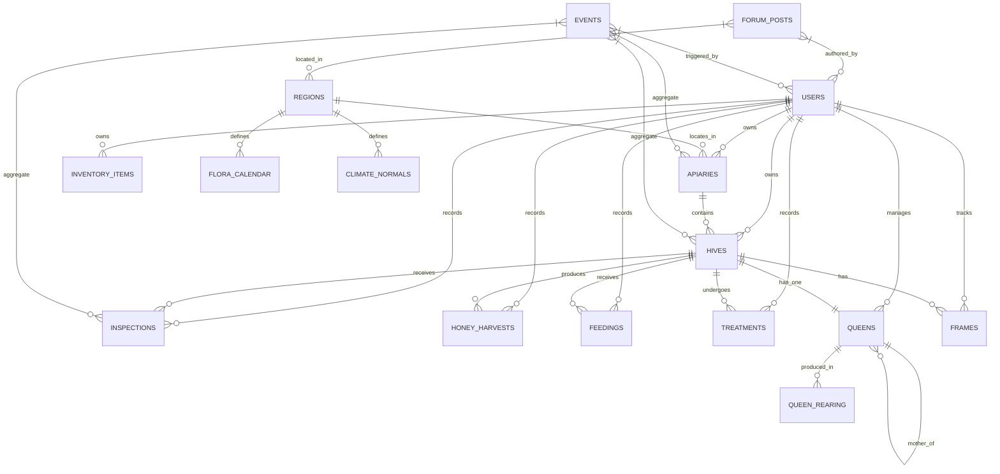

# BeeMaster AI — Veritabanı Mimarisi (Database Architecture) v1.0

> **Amaç:** Tüm veri modelleri, şemalar, indeksler, ilişkiler, migrasyon stratejisi, offline/online senkronizasyon, event sourcing ve analitik görünümler.

---

## 1. Mimari Prensipler

| Prensip | Uygulama |
|---------|----------|
| **UUIDv7** | Timestamp-ordered UUID (128-bit) → Birincil anahtarlar, sıralama ve sharding için |
| **Soft Delete** | `deleted_at` timestamp → Veri asla fiziksel silinmez, GDPR/KVKK uyumu |
| **Row Level Security (RLS)** | Her tablo `user_id` ile izole → Supabase Auth ile otomatik yetkilendirme |
| **Event Sourcing** | Her mutasyon bir `events` kaydı → Tam denetim izi, time-travel, replay |
| **Multi-Schema** | `public` (core), `analytics` (OLAP), `ai` (embeddings/agent state) |
| **Local-First Sync** | IndexedDB (Dexie) ↔ Supabase (PostgreSQL) → Conflict resolution + Background sync |

---

## 2. Şema Diyagramı (Mermaid)



---

## 3. Tablo Tanımları (PostgreSQL / Supabase)

### 3.1 Core Tablolar

```sql
-- users: Supabase Auth.users ile 1-1 (public.users view)
CREATE TABLE public.profiles (
    id UUID PRIMARY KEY REFERENCES auth.users(id) ON DELETE CASCADE,
    display_name TEXT,
    avatar_url TEXT,
    phone TEXT,
    preferred_language TEXT DEFAULT 'tr',
    preferred_theme TEXT DEFAULT 'dark',
    preferred_units TEXT DEFAULT 'metric',
    currency TEXT DEFAULT 'TRY',
    timezone TEXT DEFAULT 'Europe/Istanbul',
    onboarding_completed BOOLEAN DEFAULT FALSE,
    onboarding_step TEXT,
    created_at TIMESTAMPTZ DEFAULT NOW(),
    updated_at TIMESTAMPTZ DEFAULT NOW()
);

-- apiary: Arı üssü
CREATE TABLE public.apiaries (
    id UUID PRIMARY KEY DEFAULT gen_random_uuid_v7(),
    user_id UUID NOT NULL REFERENCES auth.users(id) ON DELETE CASCADE,
    name TEXT NOT NULL,
    description TEXT,
    location GEOGRAPHY(POINT) NOT NULL,
    address TEXT,
    elevation_m INT,
    microclimate JSONB DEFAULT '{}', -- {aspect, slope, wind_exposure, water_distance_m}
    region_id UUID REFERENCES public.regions(id),
    is_default BOOLEAN DEFAULT FALSE,
    status TEXT DEFAULT 'active' CHECK (status IN ('active', 'archived', 'seasonal')),
    created_at TIMESTAMPTZ DEFAULT NOW(),
    updated_at TIMESTAMPTZ DEFAULT NOW(),
    deleted_at TIMESTAMPTZ
);
CREATE INDEX idx_apiaries_user ON public.apiaries(user_id);
CREATE INDEX idx_apiaries_location ON public.apiaries USING GIST(location);
CREATE INDEX idx_apiaries_region ON public.apiaries(region_id);

-- hive: Kovan
CREATE TABLE public.hives (
    id UUID PRIMARY KEY DEFAULT gen_random_uuid_v7(),
    apiary_id UUID NOT NULL REFERENCES public.apiaries(id) ON DELETE CASCADE,
    user_id UUID NOT NULL REFERENCES auth.users(id) ON DELETE CASCADE,
    name TEXT NOT NULL,
    status TEXT DEFAULT 'active' CHECK (status IN ('active', 'weak', 'dead', 'sold', 'merged')),
    strain TEXT CHECK (strain IN ('anatolian', 'caucasian', 'carniolan', 'italian', 'hybrid', 'other')),
    queen_id UUID REFERENCES public.queens(id),
    box_type TEXT CHECK (box_type IN ('langstroth', 'dadant', 'layens', 'flow', 'top_bar', 'custom')),
    frame_count INT DEFAULT 10 CHECK (frame_count BETWEEN 1 AND 20),
    position_in_apiary INT,
    nfc_tag TEXT UNIQUE,
    installed_at DATE,
    created_at TIMESTAMPTZ DEFAULT NOW(),
    updated_at TIMESTAMPTZ DEFAULT NOW(),
    deleted_at TIMESTAMPTZ
);
CREATE INDEX idx_hives_apiary ON public.hives(apiary_id, position_in_apiary);
CREATE INDEX idx_hives_user_status ON public.hives(user_id, status);
CREATE INDEX idx_hives_nfc ON public.hives(nfc_tag) WHERE nfc_tag IS NOT NULL;

-- frame: Çerçeve / Petek yaşam döngüsü
CREATE TABLE public.frames (
    id UUID PRIMARY KEY DEFAULT gen_random_uuid_v7(),
    hive_id UUID NOT NULL REFERENCES public.hives(id) ON DELETE CASCADE,
    position INT NOT NULL CHECK (position BETWEEN 1 AND 20),
    frame_type TEXT CHECK (frame_type IN ('brood', 'honey', 'pollen', 'foundation', 'empty')),
    foundation_type TEXT CHECK (foundation_type IN ('wax', 'plastic', 'foundationless')),
    status TEXT DEFAULT 'in_use' CHECK (status IN ('in_use', 'extracted', 'cleaning', 'stored', 'retired')),
    cycles_completed INT DEFAULT 0,
    last_extracted_at DATE,
    wax_age_months INT,
    notes TEXT,
    created_at TIMESTAMPTZ DEFAULT NOW(),
    updated_at TIMESTAMPTZ DEFAULT NOW()
);
CREATE UNIQUE INDEX idx_frames_hive_position ON public.frames(hive_id, position);
CREATE INDEX idx_frames_hive_status ON public.frames(hive_id, status);

-- inspection: Muayene
CREATE TABLE public.inspections (
    id UUID PRIMARY KEY DEFAULT gen_random_uuid_v7(),
    hive_id UUID NOT NULL REFERENCES public.hives(id) ON DELETE CASCADE,
    user_id UUID NOT NULL REFERENCES auth.users(id) ON DELETE CASCADE,
    inspected_at TIMESTAMPTZ NOT NULL,
    duration_seconds INT,
    weather_snapshot JSONB, -- {temp, humidity, wind, condition, source}
    
    strength TEXT CHECK (strength IN ('very_weak', 'weak', 'moderate', 'strong', 'very_strong')),
    temperament TEXT CHECK (temperament IN ('calm', 'moderate', 'defensive', 'aggressive')),
    queen_status TEXT CHECK (queen_status IN ('seen', 'not_seen', 'cells_present', 'virgin', 'missing')),
    
    brood_pattern_score INT CHECK (brood_pattern_score BETWEEN 1 AND 10),
    brood_area_pct INT CHECK (brood_area_pct BETWEEN 0 AND 100),
    honey_area_pct INT CHECK (honey_area_pct BETWEEN 0 AND 100),
    pollen_area_pct INT CHECK (pollen_area_pct BETWEEN 0 AND 100),
    drone_area_pct INT CHECK (drone_area_pct BETWEEN 0 AND 100),
    empty_area_pct INT CHECK (empty_area_pct BETWEEN 0 AND 100),
    
    varroa_count INT,
    varroa_method TEXT CHECK (varroa_method IN ('alcohol_wash', 'sugar_shake', 'sticky_board', 'visual')),
    disease_signs TEXT[] DEFAULT '{}',
    
    voice_transcript TEXT,
    ai_summary TEXT,
    ai_anomalies JSONB DEFAULT '[]', -- [{type, severity, confidence, evidence}]
    ai_recommendations JSONB DEFAULT '[]', -- [{action, priority, reasoning, due_date}]
    ai_source TEXT CHECK (ai_source IN ('local', 'remote', 'hybrid')),
    ai_confidence DECIMAL(3,2),
    
    status TEXT DEFAULT 'completed' CHECK (status IN ('draft', 'completed', 'archived')),
    created_at TIMESTAMPTZ DEFAULT NOW(),
    updated_at TIMESTAMPTZ DEFAULT NOW()
);
CREATE INDEX idx_inspections_hive_date ON public.inspections(hive_id, inspected_at DESC);
CREATE INDEX idx_inspections_user_date ON public.inspections(user_id, inspected_at DESC);
CREATE INDEX idx_inspections_status ON public.inspections(status);

-- queen: Ana arı
CREATE TABLE public.queens (
    id UUID PRIMARY KEY DEFAULT gen_random_uuid_v7(),
    hive_id UUID REFERENCES public.hives(id) ON DELETE SET NULL,
    strain TEXT CHECK (strain IN ('anatolian', 'caucasian', 'carniolan', 'italian', 'hybrid', 'other')),
    birth_date DATE,
    source TEXT CHECK (source IN ('bred', 'purchased', 'swarm', 'supersedure', 'emergency')),
    supplier TEXT,
    cost_try DECIMAL(10,2),
    marked_color TEXT CHECK (marked_color IN ('white', 'yellow', 'red', 'green', 'blue')),
    status TEXT DEFAULT 'active' CHECK (status IN ('active', 'superseded', 'dead', 'sold', 'missing')),
    performance_score DECIMAL(3,2) DEFAULT 0.50 CHECK (performance_score BETWEEN 0 AND 1),
    mother_id UUID REFERENCES public.queens(id),
    father_source TEXT,
    rearing_method TEXT CHECK (rearing_method IN ('grafting', 'jenter', 'nicot', 'walk_away', 'natural')),
    superseded_at DATE,
    notes TEXT,
    created_at TIMESTAMPTZ DEFAULT NOW(),
    updated_at TIMESTAMPTZ DEFAULT NOW()
);
CREATE INDEX idx_queens_hive ON public.queens(hive_id);
CREATE INDEX idx_queens_mother ON public.queens(mother_id);

-- honey_harvests: Bal hasatları
CREATE TABLE public.honey_harvests (
    id UUID PRIMARY KEY DEFAULT gen_random_uuid_v7(),
    hive_id UUID NOT NULL REFERENCES public.hives(id) ON DELETE CASCADE,
    apiary_id UUID NOT NULL REFERENCES public.apiaries(id) ON DELETE CASCADE,
    user_id UUID NOT NULL REFERENCES auth.users(id) ON DELETE CASCADE,
    harvested_at DATE NOT NULL,
    frames_harvested INT,
    weight_kg DECIMAL(6,2) NOT NULL,
    moisture_pct DECIMAL(4,2),
    honey_type TEXT CHECK (honey_type IN ('flower', 'pine', 'chestnut', 'thyme', 'mixed', 'monofloral')),
    flora_source TEXT[] DEFAULT '{}',
    price_per_kg_try DECIMAL(10,2),
    sold_amount_kg DECIMAL(6,2) DEFAULT 0,
    notes TEXT,
    created_at TIMESTAMPTZ DEFAULT NOW()
);
CREATE INDEX idx_harvests_apiary_date ON public.honey_harvests(apiary_id, harvested_at DESC);
CREATE INDEX idx_harvests_hive_date ON public.honey_harvests(hive_id, harvested_at DESC);
CREATE INDEX idx_harvests_user_date ON public.honey_harvests(user_id, harvested_at DESC);

-- feedings: Besleme kayıtları
CREATE TABLE public.feedings (
    id UUID PRIMARY KEY DEFAULT gen_random_uuid_v7(),
    hive_id UUID NOT NULL REFERENCES public.hives(id) ON DELETE CASCADE,
    user_id UUID NOT NULL REFERENCES auth.users(id) ON DELETE CASCADE,
    fed_at TIMESTAMPTZ NOT NULL,
    feed_type TEXT CHECK (feed_type IN ('sugar_syrup_1_1', 'sugar_syrup_2_1', 'sugar_syrup_3_2', 'fondant', 'pollen_patty', 'protein_powder', 'honey')),
    amount_kg DECIMAL(5,2) NOT NULL,
    method TEXT CHECK (method IN ('top_feeder', 'frame_feeder', 'entrance_feeder', 'dribble', 'spray')),
    reason TEXT CHECK (reason IN ('winter_prep', 'spring_build', 'dearth', 'queen_rearing', 'stimulation', 'emergency')),
    consumed_kg DECIMAL(5,2),
    cost_try DECIMAL(10,2),
    notes TEXT,
    created_at TIMESTAMPTZ DEFAULT NOW()
);
CREATE INDEX idx_feedings_hive_date ON public.feedings(hive_id, fed_at DESC);
CREATE INDEX idx_feedings_user_date ON public.feedings(user_id, fed_at DESC);

-- treatments: Tedavi kayıtları
CREATE TABLE public.treatments (
    id UUID PRIMARY KEY DEFAULT gen_random_uuid_v7(),
    hive_id UUID NOT NULL REFERENCES public.hives(id) ON DELETE CASCADE,
    user_id UUID NOT NULL REFERENCES auth.users(id) ON DELETE CASCADE,
    started_at DATE NOT NULL,
    ended_at DATE,
    treatment_type TEXT CHECK (treatment_type IN (
        'varroa_oxalic_vapor', 'varroa_oxalic_dribble', 'varroa_formic', 
        'varroa_amitraz', 'varroa_flumethrin', 'varroa_thymol',
        'nosema_fumagillin', 'afb_shake', 'other'
    )),
    product_name TEXT,
    active_ingredient TEXT,
    dosage TEXT,
    application_method TEXT,
    pre_treatment_varroa INT,
    post_treatment_varroa INT,
    efficacy_pct DECIMAL(5,2),
    cost_try DECIMAL(10,2),
    notes TEXT,
    status TEXT DEFAULT 'active' CHECK (status IN ('planned', 'active', 'completed', 'failed', 'cancelled')),
    created_at TIMESTAMPTZ DEFAULT NOW(),
    updated_at TIMESTAMPTZ DEFAULT NOW()
);
CREATE INDEX idx_treatments_hive_date ON public.treatments(hive_id, started_at DESC);

-- inventory_items: Envanter
CREATE TABLE public.inventory_items (
    id UUID PRIMARY KEY DEFAULT gen_random_uuid_v7(),
    user_id UUID NOT NULL REFERENCES auth.users(id) ON DELETE CASCADE,
    name TEXT NOT NULL,
    category TEXT CHECK (category IN ('equipment', 'consumable', 'medication', 'feed', 'tool', 'protective', 'extraction', 'packaging')),
    unit TEXT CHECK (unit IN ('piece', 'kg', 'liter', 'meter', 'box', 'pack')),
    current_stock DECIMAL(10,2) DEFAULT 0,
    min_stock DECIMAL(10,2) DEFAULT 0,
    max_stock DECIMAL(10,2),
    unit_cost_try DECIMAL(10,2),
    supplier TEXT,
    expiry_date DATE,
    location TEXT,
    barcode TEXT,
    notes TEXT,
    notify_low_stock BOOLEAN DEFAULT TRUE,
    notify_expiry BOOLEAN DEFAULT TRUE,
    created_at TIMESTAMPTZ DEFAULT NOW(),
    updated_at TIMESTAMPTZ DEFAULT NOW()
);
CREATE INDEX idx_inventory_user_category ON public.inventory_items(user_id, category);
CREATE INDEX idx_inventory_low_stock ON public.inventory_items(user_id) WHERE current_stock <= min_stock;

-- inventory_movements: Stok hareketleri
CREATE TABLE public.inventory_movements (
    id UUID PRIMARY KEY DEFAULT gen_random_uuid_v7(),
    item_id UUID NOT NULL REFERENCES public.inventory_items(id) ON DELETE CASCADE,
    user_id UUID NOT NULL REFERENCES auth.users(id) ON DELETE CASCADE,
    type TEXT CHECK (type IN ('in', 'out', 'adjustment', 'transfer')),
    quantity DECIMAL(10,2) NOT NULL,
    unit_cost_try DECIMAL(10,2),
    total_cost_try DECIMAL(10,2) GENERATED ALWAYS AS (quantity * unit_cost_try) STORED,
    hive_id UUID REFERENCES public.hives(id),
    apiary_id UUID REFERENCES public.apiaries(id),
    related_operation TEXT CHECK (related_operation IN ('treatment', 'feeding', 'harvest', 'maintenance', 'setup', 'sale', 'transfer', 'loss', 'adjustment', 'other')),
    related_operation_id UUID,
    supplier TEXT,
    invoice_number TEXT,
    date TIMESTAMPTZ NOT NULL DEFAULT NOW(),
    notes TEXT
);
CREATE INDEX idx_inventory_movements_item_date ON public.inventory_movements(item_id, date DESC);
```

### 3.2 Topluluk ve Bölge Tabloları

```sql
-- regions: Bölgeler (İl/İlçe/Mahalle hiyerarşisi)
CREATE TABLE public.regions (
    id UUID PRIMARY KEY DEFAULT gen_random_uuid_v7(),
    name TEXT NOT NULL,
    parent_id UUID REFERENCES public.regions(id),
    level TEXT CHECK (level IN ('country', 'province', 'district', 'neighborhood')),
    polygon GEOGRAPHY(POLYGON),
    centroid GEOGRAPHY(POINT),
    flora_calendar JSONB, -- Ay bazlı çiçeklenme verisi
    climate_normals JSONB, -- Aylık ortalama sıcaklık, yağış, nem
    varroa_prevalence JSONB, -- Bölgesel varroa istatistikleri
    active_beekeepers INT DEFAULT 0,
    created_at TIMESTAMPTZ DEFAULT NOW()
);
CREATE INDEX idx_regions_parent ON public.regions(parent_id);
CREATE INDEX idx_regions_centroid ON public.regions USING GIST(centroid);

-- forum_posts: Topluluk forumu
CREATE TABLE public.forum_posts (
    id UUID PRIMARY KEY DEFAULT gen_random_uuid_v7(),
    user_id UUID NOT NULL REFERENCES auth.users(id) ON DELETE CASCADE,
    region_id UUID REFERENCES public.regions(id),
    title TEXT NOT NULL,
    content TEXT NOT NULL,
    post_type TEXT CHECK (post_type IN ('question', 'observation', 'alert', 'harvest_report', 'technique', 'marketplace')),
    tags TEXT[] DEFAULT '{}',
    is_pinned BOOLEAN DEFAULT FALSE,
    is_resolved BOOLEAN DEFAULT FALSE,
    view_count INT DEFAULT 0,
    created_at TIMESTAMPTZ DEFAULT NOW(),
    updated_at TIMESTAMPTZ DEFAULT NOW()
);
CREATE INDEX idx_forum_region_type ON public.forum_posts(region_id, post_type);
CREATE INDEX idx_forum_user ON public.forum_posts(user_id);
```

### 3.3 AI ve Event Tabloları

```sql
-- ai_agent_states: Ajan çalışma hafızası
CREATE TABLE public.ai_agent_states (
    id UUID PRIMARY KEY DEFAULT gen_random_uuid_v7(),
    user_id UUID NOT NULL REFERENCES auth.users(id) ON DELETE CASCADE,
    hive_id UUID REFERENCES public.hives(id) ON DELETE CASCADE,
    agent_type TEXT CHECK (agent_type IN ('inspection', 'queen', 'disease', 'honey', 'feeding', 'forecast')),
    state JSONB NOT NULL, -- Working memory, context, intermediate results
    embedding VECTOR(1536), -- Semantic search için
    version INT DEFAULT 1,
    created_at TIMESTAMPTZ DEFAULT NOW(),
    updated_at TIMESTAMPTZ DEFAULT NOW()
);
CREATE INDEX idx_ai_agent_hive_type ON public.ai_agent_states(hive_id, agent_type);
CREATE INDEX idx_ai_agent_user_type ON public.ai_agent_states(user_id, agent_type);
CREATE INDEX idx_ai_agent_embedding ON public.ai_agent_states USING hnsw (embedding vector_cosine_ops);

-- events: Event Store (Denetim izi / Replay)
CREATE TABLE public.events (
    id BIGSERIAL PRIMARY KEY,
    aggregate_id UUID NOT NULL,
    aggregate_type TEXT NOT NULL CHECK (aggregate_type IN ('hive', 'apiary', 'inspection', 'queen', 'treatment', 'feeding', 'harvest', 'inventory', 'user')),
    event_type TEXT NOT NULL, -- 'HiveCreated', 'InspectionRecorded', 'QueenReplaced', etc.
    payload JSONB NOT NULL,
    metadata JSONB, -- {userAgent, ip, correlationId, causationId}
    user_id UUID REFERENCES auth.users(id),
    created_at TIMESTAMPTZ DEFAULT NOW()
);
CREATE INDEX idx_events_aggregate ON public.events(aggregate_id, aggregate_type);
CREATE INDEX idx_events_created ON public.events(created_at DESC);
CREATE INDEX idx_events_type ON public.events(event_type);

-- sync_queue: Offline senkronizasyon kuyruğu (Client-side IndexedDB'de da vardır)
CREATE TABLE public.sync_operations (
    id UUID PRIMARY KEY DEFAULT gen_random_uuid_v7(),
    user_id UUID NOT NULL REFERENCES auth.users(id) ON DELETE CASCADE,
    table_name TEXT NOT NULL,
    operation TEXT CHECK (operation IN ('create', 'update', 'delete')),
    payload JSONB NOT NULL,
    local_id TEXT, -- Client-side UUID
    server_id TEXT, -- Server-side UUID (create sonrası)
    timestamp TIMESTAMPTZ DEFAULT NOW(),
    retry_count INT DEFAULT 0,
    status TEXT DEFAULT 'pending' CHECK (status IN ('pending', 'processing', 'completed', 'failed', 'conflict')),
    error_message TEXT
);
CREATE INDEX idx_sync_queue_user_status ON public.sync_operations(user_id, status);
```

---

## 4. Materialized Views (Analitik / OLAP)

```sql
-- analytics.hive_monthly_summary: Kovan aylık özeti
CREATE MATERIALIZED VIEW analytics.hive_monthly_summary AS
SELECT 
    h.id AS hive_id,
    h.apiary_id,
    h.user_id,
    date_trunc('month', i.inspected_at)::date AS month,
    
    -- Verim
    COALESCE(SUM(hv.weight_kg) FILTER (WHERE date_trunc('month', hv.harvested_at) = date_trunc('month', i.inspected_at)), 0) AS total_honey_kg,
    COUNT(DISTINCT hv.id) FILTER (WHERE date_trunc('month', hv.harvested_at) = date_trunc('month', i.inspected_at)) AS harvest_count,
    
    -- Güç
    AVG(CASE i.strength 
        WHEN 'very_weak' THEN 1 
        WHEN 'weak' THEN 2 
        WHEN 'moderate' THEN 3 
        WHEN 'strong' THEN 4 
        WHEN 'very_strong' THEN 5 
    END) AS avg_strength_score,
    
    -- Varroa
    AVG(i.varroa_count) FILTER (WHERE i.varroa_count IS NOT NULL) AS avg_varroa,
    MAX(i.varroa_count) FILTER (WHERE i.varroa_count IS NOT NULL) AS max_varroa,
    
    -- Tedavi
    COUNT(DISTINCT t.id) FILTER (WHERE date_trunc('month', t.started_at) = date_trunc('month', i.inspected_at)) AS treatment_count,
    
    -- Besleme
    COALESCE(SUM(f.amount_kg) FILTER (WHERE date_trunc('month', f.fed_at) = date_trunc('month', i.inspected_at)), 0) AS total_feed_kg,
    COALESCE(SUM(f.cost_try) FILTER (WHERE date_trunc('month', f.fed_at) = date_trunc('month', i.inspected_at)), 0) AS total_feed_cost,
    
    -- Maliyet
    COALESCE(SUM(t.cost_try) FILTER (WHERE date_trunc('month', t.started_at) = date_trunc('month', i.inspected_at)), 0) AS total_treatment_cost
    
FROM public.hives h
LEFT JOIN public.inspections i ON i.hive_id = h.id
LEFT JOIN public.honey_harvests hv ON hv.hive_id = h.id
LEFT JOIN public.treatments t ON t.hive_id = h.id
LEFT JOIN public.feedings f ON f.hive_id = h.id
WHERE h.deleted_at IS NULL
GROUP BY h.id, h.apiary_id, h.user_id, date_trunc('month', i.inspected_at);

CREATE UNIQUE INDEX ON analytics.hive_monthly_summary (hive_id, month);
```

```sql
-- analytics.regional_benchmark: Bölgesel karşılaştırma
CREATE MATERIALIZED VIEW analytics.regional_benchmark AS
SELECT 
    r.id AS region_id,
    r.name AS region_name,
    date_trunc('month', i.inspected_at)::date AS month,
    
    AVG(hive_yield.total_kg) AS avg_yield_per_hive,
    PERCENTILE_CONT(0.5) WITHIN GROUP (ORDER BY hive_yield.total_kg) AS median_yield,
    PERCENTILE_CONT(0.9) WITHIN GROUP (ORDER BY hive_yield.total_kg) AS p90_yield,
    
    AVG(hive_health.avg_varroa) AS avg_varroa,
    PERCENTILE_CONT(0.9) WITHIN GROUP (ORDER BY hive_health.max_varroa) AS p90_varroa,
    
    AVG(hive_health.avg_strength_score) AS avg_strength,
    COUNT(DISTINCT h.id) * 100.0 / NULLIF(SUM(CASE WHEN h.status = 'active' THEN 1 ELSE 0 END), 0) AS survival_rate,
    
    AVG(hive_cost.total_cost) AS avg_cost_per_hive
    
FROM public.regions r
JOIN public.apiaries a ON ST_Contains(r.polygon, a.location) OR a.region_id = r.id
JOIN public.hives h ON h.apiary_id = a.id
JOIN analytics.hive_monthly_summary hive_yield ON hive_yield.hive_id = h.id AND hive_yield.month = date_trunc('month', i.inspected_at)::date
JOIN analytics.hive_monthly_summary hive_health ON hive_health.hive_id = h.id AND hive_health.month = date_trunc('month', i.inspected_at)::date
JOIN analytics.hive_monthly_summary hive_cost ON hive_cost.hive_id = h.id AND hive_cost.month = date_trunc('month', i.inspected_at)::date
LEFT JOIN public.inspections i ON i.hive_id = h.id
WHERE h.deleted_at IS NULL AND h.status = 'active'
GROUP BY r.id, r.name, date_trunc('month', i.inspected_at);
```

```sql
-- Tetikleyici: Her saat yenile (Supabase pg_cron)
SELECT cron.schedule('refresh-analytics', '0 * * * *', $$
    REFRESH MATERIALIZED VIEW CONCURRENTLY analytics.hive_monthly_summary;
    REFRESH MATERIALIZED VIEW CONCURRENTLY analytics.regional_benchmark;
$$);
```

---

## 5. Vektör Veritabanı (Embeddings)

| Kullanım | Teknoloji | Boyut | Model |
|----------|-----------|-------|-------|
| **Semantic Search** | pgvector (Supabase) / ChromaDB (local) | 1536 | text-embedding-3-small |
| **RAG (Literatür)** | ChromaDB | 1024 | BGE-M3 |
| **Agent Memory** | pgvector | 1536 | text-embedding-3-small |

```sql
-- pgvector extension
CREATE EXTENSION IF NOT EXISTS vector;

-- knowledge_chunks: RAG için bilgi parçaları
CREATE TABLE public.knowledge_chunks (
    id UUID PRIMARY KEY DEFAULT gen_random_uuid_v7(),
    source_type TEXT CHECK (source_type IN ('literature', 'protocol', 'forum', 'user_note', 'regulation')),
    source_id TEXT,
    title TEXT,
    content TEXT NOT NULL,
    metadata JSONB, -- {region, strain, season, disease, author, year}
    embedding VECTOR(1536),
    created_at TIMESTAMPTZ DEFAULT NOW()
);
CREATE INDEX ON public.knowledge_chunks USING hnsw (embedding vector_cosine_ops);
CREATE INDEX ON public.knowledge_chunks (source_type, metadata);
```

---

## 6. İndeksleme Stratejisi

| Tablo | Critcal Indexes | Neden |
|-------|-----------------|-------|
| `inspections` | `(hive_id, inspected_at DESC)`, `(user_id, inspected_at DESC)` | Kovan/kullanıcı geçmişi sorguları |
| `hives` | `(apiary_id, position_in_apiary)`, `(user_id, status)` | Apiary listeleme, filtreleme |
| `frames` | `(hive_id, position)`, `(hive_id, status)` | Kovan içi çerçeve haritası |
| `honey_harvests` | `(apiary_id, harvested_at DESC)`, `(user_id, harvested_at DESC)` | Verim raporları |
| `ai_agent_states` | `(hive_id, agent_type)`, `(user_id, agent_type)` | Agent state yükleme |
| `events` | `(aggregate_id, aggregate_type, created_at DESC)` | Event replay, audit |
| `sync_operations` | `(user_id, status, timestamp)` | Offline senkron |

---

## 7. Offline Senkronizasyon Protokolü

### 7.1 Client-Side (IndexedDB / Dexie.js)

```typescript
// db.ts
class BeeMasterDB extends Dexie {
    apiaries!: Table<Apiary>;
    hives!: Table<Hive>;
    frames!: Table<Frame>;
    inspections!: Table<Inspection>;
    queens!: Table<Queen>;
    harvests!: Table<HoneyHarvest>;
    feedings!: Table<Feeding>;
    treatments!: Table<Treatment>;
    inventory!: Table<InventoryItem>;
    syncQueue!: Table<SyncOperation>;
    media!: Table<MediaFile>;
    
    constructor() {
        super('BeeMasterDB');
        this.version(1).stores({
            apiaries: 'id, user_id, name, location, created_at',
            hives: 'id, apiary_id, user_id, name, status, queen_id, nfc_tag, created_at',
            frames: 'id, hive_id, position, frame_type, status, cycles_completed',
            inspections: 'id, hive_id, user_id, inspected_at, created_at, synced',
            queens: 'id, hive_id, strain, birth_date, status, created_at',
            harvests: 'id, hive_id, apiary_id, user_id, harvested_at, weight_kg',
            feedings: 'id, hive_id, user_id, fed_at, feed_type, amount_kg',
            treatments: 'id, hive_id, user_id, started_at, treatment_type',
            inventory: 'id, user_id, name, category, current_stock',
            syncQueue: 'id, table, operation, payload, timestamp, retry_count',
            media: 'id, entity_type, entity_id, mime_type, created_at'
        });
    }
}

export const db = new BeeMasterDB();
```

### 7.2 Senkronizasyon Motoru

```typescript
// sync-engine.ts
interface SyncOperation {
    id: string;
    table: string;
    operation: 'create' | 'update' | 'delete';
    payload: Record<string, any>;
    timestamp: number;
    retryCount: number;
    serverId?: string;
}

class SyncEngine {
    private db: BeeMasterDB;
    private isOnline: boolean = navigator.onLine;
    private syncInProgress: boolean = false;
    
    constructor(db: BeeMasterDB) {
        this.db = db;
        this.setupListeners();
    }
    
    private setupListeners() {
        window.addEventListener('online', () => { this.isOnline = true; this.flushQueue(); });
        window.addEventListener('offline', () => { this.isOnline = false; });
        setInterval(() => { if (this.isOnline) this.flushQueue(); }, 5 * 60 * 1000);
    }
    
    async queueOperation(op: Omit<SyncOperation, 'id' | 'retryCount'>) {
        const id = crypto.randomUUID();
        await this.db.syncQueue.add({ ...op, id, retryCount: 0, timestamp: Date.now() });
        if (this.isOnline) this.flushQueue();
    }
    
    async flushQueue() {
        if (this.syncInProgress || !this.isOnline) return;
        this.syncInProgress = true;
        
        const pending = await this.db.syncQueue
            .orderBy('timestamp')
            .limit(50)
            .toArray();
        
        for (const op of pending) {
            try {
                await this.executeOperation(op);
                await this.db.syncQueue.delete(op.id);
            } catch (err) {
                if (op.retryCount >= 5) {
                    await this.moveToDeadLetter(op, err);
                } else {
                    await this.db.syncQueue.update(op.id, { retryCount: op.retryCount + 1 });
                }
            }
        }
        
        await this.pullChanges();
        this.syncInProgress = false;
    }
    
    private async executeOperation(op: SyncOperation) {
        const res = await fetch('/api/v1/sync/push', {
            method: 'POST',
            headers: { 'Content-Type': 'application/json', 'Authorization': `Bearer ${await this.getToken()}` },
            body: JSON.stringify([op])
        });
        if (!res.ok) throw new Error(`Sync failed: ${res.status}`);
        const result = await res.json();
        if (op.operation === 'create' && result.serverId) {
            await this.remapLocalIds(op.table, op.payload.id, result.serverId);
        }
    }
}
```

### 7.3 Çakışma Çözümleme

| Senaryo | Strateji |
|---------|----------|
| Aynı alan, farklı cihazlarda güncellendi | **Last-Writer-Wins** (timestamp bazlı) + kullanıcı bildirimi |
| Aynı kovan için çakışan muayene | **Merge** — her ikisini** — her iki muayene de ayrı kayıt, AI birleştirir |
| Silinen kayıt güncellendi | **Resurrect** — silme iptal, güncelleme uygulanır |
| Çakışma çözülemiyor | **Manual** — kullanıcıya "Çakışma Çözücü" UI |

---

## 8. Migrasyon Stratejisi

```sql
-- migrations/001_initial_schema.sql
-- Supabase CLI ile yönetilir: supabase migration new <name>

-- Her migrasyon:
-- 1. Geriye uyumlu (additive only: yeni tablo, kolon, index)
-- 2. Veri migrasyonu ayrı dosyada (data migration)
-- 3. Rollback planı (down migration) hazırlanır
-- 4. Staging'de test edilir, production'a canary deploy

-- Örnek: Yeni kolon ekleme
ALTER TABLE public.hives ADD COLUMN IF NOT EXISTS wintered_at DATE;
CREATE INDEX IF NOT EXISTS idx_hives_wintered ON public.hives(wintered_at);
```

---

## 9. Yedekleme ve Kurtarma

| Strateji | Detay |
|----------|-------|
| **Point-in-Time Recovery (PITR)** | Supabase otomatik: 7 gün (Free), 30 gün (Pro) |
| **Günlük Dump** | `pg_dump` → S3/GCS, 90 gün saklama |
| **Çapraz Bölge Replikasyon** | Primary: eu-central-1, Standby: eu-west-1 |
| **İndeks/Yedek Testi** | Haftalık: Rastgele tablo restore → Veri doğrulama |

---

## 10. Güvenlik ve Uyumluluk

| Özellik | Uygulama |
|---------|----------|
| **RLS Policies** | Her tablo: `CREATE POLICY ... USING (auth.uid() = user_id)` |
| **Şifreleme** | TLS 1.3 (transfer), AES-256 (rest - Supabase yönetir) |
| **PII Maskeleme** | AI prompt'larından önce: isim→hash, konum→bölge kodu, telefon→masked |
| **KVKK/GDPR** | Veri silme talebi → `deleted_at` + anonimleştirme, 30 gün iptal süresi |
| **Audit Log** | `events` tablosu: Her mutasyon, IP, user-agent, correlation ID |

---

## 11. Performans Hedefleri

| Metrik | Hedef |
|--------|-------|
| **Sorgu Süresi (p95)** | < 100ms (OLTP), < 500ms (OLAP materialized view) |
| **Yazma Gecikmesi** | < 50ms (local), < 200ms (sync push) |
| **Depolama Büyümesi** | ~50 MB / 1000 kovan / yıl (medya hariç) |
| **Senkron Başarı Oranı** | > 99.9% |
| **Çakışma Oranı** | < 0.1% |

---

## 12. Gelecek Geliştirmeler (v1.5+)

| Özellik | Açıklama |
|---------|----------|
| **TimescaleDB Hypertables** | Zaman serisi verileri (hava, ağırlık, sıcaklık) için otomatik chunking |
| **Read Replicas** | Analitik sorguları ana DB'den ayırma |
| **CDC (Change Data Capture)** | Debezium → Kafka → Real-time analytics / ML pipeline |
| **Multi-Tenant Isolation** | Şema bazlı izolasyon (Enterprise/Coop modu) |
| **GraphQL API** | Hasura / Supabase Realtime → Esnek sorgulama |